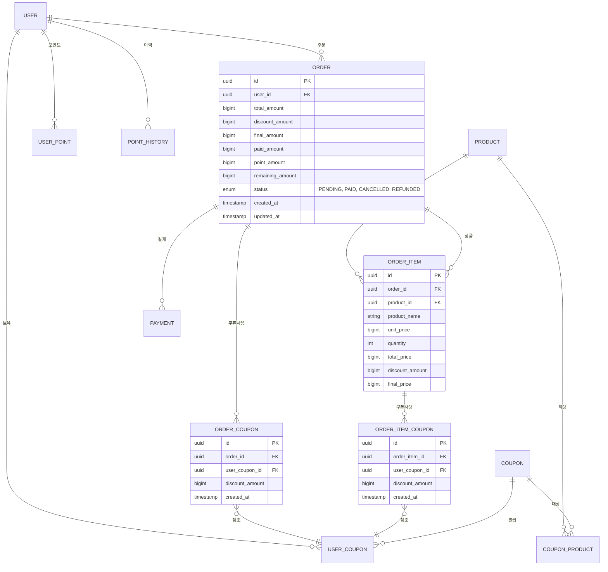

# ERD - Multiple Coupons Support

## 여러 쿠폰 사용을 위한 ERD 수정안

### 변경 사항
- ORDER.user_coupon_id 제거
- ORDER_ITEM.user_coupon_id 제거
- ORDER_COUPON 테이블 추가 (주문 레벨 쿠폰)
- ORDER_ITEM_COUPON 테이블 추가 (상품 레벨 쿠폰)

---

## Mermaid ERD



---

## 사용 예시

### 시나리오: 주문 레벨 쿠폰 2개 + 상품 레벨 쿠폰 1개

```
ORDER (total: 100,000원)
├─ ORDER_COUPON 1: 전체 10% 할인 → -10,000원
├─ ORDER_COUPON 2: 5,000원 할인 → -5,000원
├─ ORDER_ITEM 1 (상품A: 50,000원)
│  └─ ORDER_ITEM_COUPON 1: 3,000원 할인 → -3,000원
└─ ORDER_ITEM 2 (상품B: 50,000원)

최종 금액: 100,000 - 10,000 - 5,000 - 3,000 = 82,000원
```

---

## 환불 시 쿠폰 복구

```sql
-- 주문 레벨 쿠폰 복구
UPDATE user_coupon uc
SET status = 'AVAILABLE', used_at = NULL
WHERE id IN (
    SELECT user_coupon_id 
    FROM order_coupon 
    WHERE order_id = ?
);

-- 상품 레벨 쿠폰 복구
UPDATE user_coupon uc
SET status = 'AVAILABLE', used_at = NULL
WHERE id IN (
    SELECT user_coupon_id 
    FROM order_item_coupon oic
    JOIN order_item oi ON oic.order_item_id = oi.id
    WHERE oi.order_id = ?
);
```
