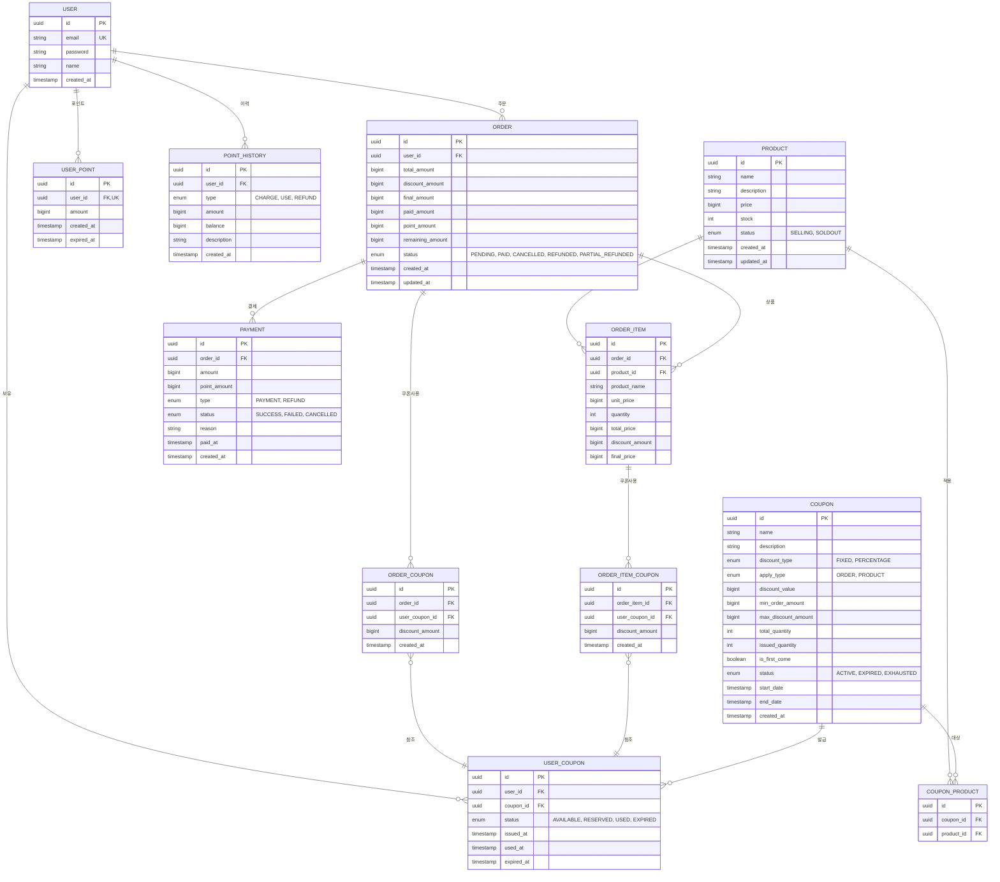

# ERD v2 - HHPlus E-Commerce

## Mermaid ERD



## 테이블 상세 설명

### 1. USER (사용자)
- **PK**: id (UUID)
- **UK**: email (중복 불가)
- **관계**: 
  - Point (1:1)
  - Order (1:N)
  - UserCoupon (1:N)
  - PointHistory (1:N)

### 2. PRODUCT (상품)
- **PK**: id (UUID)
- **동시성 제어**: stock 필드에 낙관적/비관적 락 적용
- **비즈니스 로직**: 
  - stock = 0 → status = SOLDOUT (자동)
  - stock > 0 → status = SELLING (자동)
- **관계**:
  - OrderItem (1:N)
  - CouponProduct (1:N)

### 3. ORDER (주문)
- **PK**: id (UUID)
- **FK**: user_id, user_coupon_id (nullable)
- **금액 계산**:
  - total_amount = Σ(상품 단가 × 수량)
  - discount_amount = 쿠폰 할인
  - final_amount = total_amount - discount_amount
  - paid_amount = 결제된 금액
  - point_amount = 포인트 사용 금액
  - remaining_amount = final_amount - paid_amount
- **상태 전이**:
  - PENDING → PAID (결제 완료)
  - PENDING → CANCELLED (주문 취소)
  - PAID → REFUNDED (전액 환불)
  - PAID → PARTIAL_REFUNDED (부분 환불)
- **관계**:
  - User (N:1)
  - OrderItem (1:N)
  - Payment (1:N)
  - UserCoupon (N:1, optional)

### 4. ORDER_ITEM (주문 상품)
- **PK**: id (UUID)
- **FK**: order_id, product_id, user_coupon_id (nullable)
- **비정규화**: product_name 저장 (상품 삭제 시에도 주문 이력 유지)
- **쿠폰 적용**: 
  - user_coupon_id가 있으면 → 해당 상품에 쿠폰 적용
  - NULL이면 → 쿠폰 미적용 또는 ORDER 레벨 쿠폰 적용
- **금액 계산**:
  - total_price = unit_price × quantity
  - discount_amount = 쿠폰 할인 (상품별)
  - final_price = total_price - discount_amount
- **관계**:
  - Order (N:1)
  - Product (N:1)
  - UserCoupon (N:1, optional)

### 5. PAYMENT (결제/환불)
- **PK**: id (UUID)
- **FK**: order_id
- **type**: 
  - PAYMENT: 결제
  - REFUND: 환불 (음수 금액)
- **동일 주문에 여러 Payment 레코드 가능**:
  - 부분 결제
  - 부분 환불
- **관계**:
  - Order (N:1)

### 6. USER_POINT (사용자 포인트)
- **PK**: id (UUID)
- **UK**: user_id
- **포인트 만료 관리**: expired_at으로 만료일 추적
- **잔액 계산**: SUM(amount) WHERE expired_at > NOW()
- **관계**:
  - User (N:1)

### 7. POINT_HISTORY (포인트 이력)
- **PK**: id (UUID)
- **FK**: user_id
- **type**:
  - CHARGE: 충전
  - USE: 사용
  - REFUND: 환불
- **balance**: 해당 시점의 잔액 (스냅샷)
- **관계**:
  - User (N:1)

### 8. COUPON (쿠폰)
- **PK**: id (UUID)
- **apply_type**:
  - ORDER: 주문 전체에 적용
  - PRODUCT: 특정 상품에만 적용
- **discount_type**:
  - FIXED: 정액 할인
  - PERCENTAGE: 정률 할인
- **수량 관리**:
  - total_quantity: 총 발급 가능 수량
  - issued_quantity: 발급된 수량 (동시성 제어 대상)
  - remaining = total_quantity - issued_quantity (계산)
- **동시성 제어**: is_first_come = true일 때 issued_quantity 증가 시 락 적용
- **상태**:
  - ACTIVE: 활성
  - EXPIRED: 만료
  - EXHAUSTED: 수량 소진
- **관계**:
  - UserCoupon (1:N)
  - CouponProduct (1:N)

### 9. COUPON_PRODUCT (쿠폰-상품 매핑)
- **PK**: id (UUID)
- **FK**: coupon_id, product_id
- **목적**: 특정 상품에만 적용되는 쿠폰 관리
- **비어있으면**: 전체 상품에 적용
- **관계**:
  - Coupon (N:1)
  - Product (N:1)

### 10. USER_COUPON (사용자 쿠폰)
- **PK**: id (UUID)
- **FK**: user_id, coupon_id
- **UK**: (user_id, coupon_id) - 중복 발급 방지
- **상태 전이**:
  - AVAILABLE: 사용 가능
  - RESERVED: 주문 생성 시 예약
  - USED: 결제 완료 시 사용 확정
  - EXPIRED: 만료
- **관계**:
  - User (N:1)
  - Coupon (N:1)
  - Order (1:N, optional)

## 인덱스 전략

```sql
-- USER
CREATE UNIQUE INDEX idx_user_email ON user(email);

-- PRODUCT
CREATE INDEX idx_product_status ON product(status);
CREATE INDEX idx_product_created_at ON product(created_at);

-- ORDER
CREATE INDEX idx_order_user_id ON order(user_id);
CREATE INDEX idx_order_status ON order(status);
CREATE INDEX idx_order_created_at ON order(created_at);

-- ORDER_ITEM
CREATE INDEX idx_order_item_order_id ON order_item(order_id);
CREATE INDEX idx_order_item_product_id ON order_item(product_id);

-- PAYMENT
CREATE INDEX idx_payment_order_id ON payment(order_id);
CREATE INDEX idx_payment_user_id ON payment(user_id);
CREATE INDEX idx_payment_type ON payment(type);

-- POINT
CREATE UNIQUE INDEX idx_point_user_id ON point(user_id);

-- POINT_HISTORY
CREATE INDEX idx_point_history_user_id ON point_history(user_id);
CREATE INDEX idx_point_history_created_at ON point_history(created_at);

-- COUPON
CREATE INDEX idx_coupon_status ON coupon(status);
CREATE INDEX idx_coupon_dates ON coupon(start_date, end_date);

-- COUPON_PRODUCT
CREATE INDEX idx_coupon_product_coupon_id ON coupon_product(coupon_id);
CREATE INDEX idx_coupon_product_product_id ON coupon_product(product_id);

-- USER_COUPON
CREATE UNIQUE INDEX idx_user_coupon_unique ON user_coupon(user_id, coupon_id);
CREATE INDEX idx_user_coupon_user_id ON user_coupon(user_id);
CREATE INDEX idx_user_coupon_status ON user_coupon(status);
```

## 동시성 제어 전략

### 1. 재고 차감 (Product.stock)
```sql
-- 비관적 락
SELECT * FROM product WHERE id = ? FOR UPDATE;

-- 또는 낙관적 락
ALTER TABLE product ADD COLUMN version BIGINT DEFAULT 0;
```

### 2. 쿠폰 발급 (Coupon.issued_quantity)
```sql
-- 비관적 락
SELECT * FROM coupon WHERE id = ? FOR UPDATE;
UPDATE coupon SET issued_quantity = issued_quantity + 1 
WHERE id = ? AND issued_quantity < total_quantity;

-- 또는 Redis 활용
INCR coupon:issued:{coupon_id}
```

### 3. 포인트 충전/사용 (USER_POINT)
```sql
-- 비관적 락 (만료되지 않은 포인트 조회)
SELECT * FROM user_point 
WHERE user_id = ? AND expired_at > NOW() 
FOR UPDATE;

-- 또는 낙관적 락
ALTER TABLE user_point ADD COLUMN version BIGINT DEFAULT 0;
```

## 비즈니스 제약 조건

```sql
-- 1. 재고는 음수 불가
ALTER TABLE product ADD CONSTRAINT chk_product_stock CHECK (stock >= 0);

-- 2. 포인트 금액은 음수 불가
ALTER TABLE user_point ADD CONSTRAINT chk_user_point_amount CHECK (amount >= 0);

-- 3. 쿠폰 수량 관계
ALTER TABLE coupon ADD CONSTRAINT chk_coupon_quantity 
  CHECK (issued_quantity <= total_quantity);

-- 4. 주문 금액 관계
ALTER TABLE order ADD CONSTRAINT chk_order_amount 
  CHECK (final_amount = total_amount - discount_amount);

-- 5. 사용자 쿠폰 중복 발급 방지
ALTER TABLE user_coupon ADD CONSTRAINT uk_user_coupon 
  UNIQUE (user_id, coupon_id);
```

## 데이터 예시

### 주문 생성 시나리오
```
1. Product: stock=10 → 5 예약 → stock=5, status=SELLING
2. UserCoupon: status=AVAILABLE → RESERVED
3. Order: 
   - total_amount=50000
   - discount_amount=5000 (쿠폰)
   - final_amount=45000
   - status=PENDING
4. OrderItem: 
   - total_price=50000
   - discount_amount=5000
   - final_price=45000
```

### 결제 완료 시나리오
```
1. UserPoint: 
   - 만료되지 않은 포인트 조회 및 차감
   - 총 잔액 100000 → 10000 사용 → 90000
2. Payment:
   - amount=45000
   - point_amount=10000
   - type=PAYMENT
   - status=SUCCESS
3. Order:
   - paid_amount=45000
   - point_amount=10000
   - remaining_amount=0
   - status=PAID
4. UserCoupon: status=RESERVED → USED
5. PointHistory:
   - type=USE
   - amount=-10000
   - balance=90000
```

### 환불 시나리오
```
1. Payment:
   - amount=-45000 (음수)
   - type=REFUND
   - status=SUCCESS
2. Order:
   - status=REFUNDED
3. UserPoint: 
   - 포인트 복구 (새 레코드 생성)
   - amount=10000, expired_at=기존 만료일
4. Product: stock=5 → 5 복구 → stock=10
5. UserCoupon: status=USED → AVAILABLE
6. PointHistory:
   - type=REFUND
   - amount=10000
   - balance=100000
```
