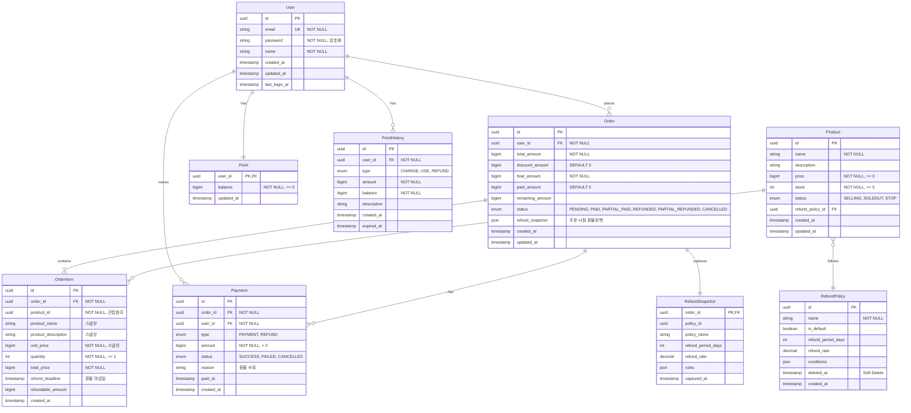

# E-Commerce ERD

## Entity Relationship Diagram



## 제약 조건

### Primary Keys
- 모든 테이블: `id` (UUID)
- Point: `user_id` (1:1 관계)
- RefundSnapshot: `order_id` (1:1 관계)

### Foreign Keys
- `Order.user_id` → `User.id` (ON DELETE RESTRICT)
- `OrderItem.order_id` → `Order.id` (ON DELETE CASCADE)
- `OrderItem.product_id` → `Product.id` ⚠️ **간접 참조 (FK 제약 없음)**
- `Payment.order_id` → `Order.id` (1:N, ON DELETE RESTRICT)
- `Payment.user_id` → `User.id` (ON DELETE RESTRICT)
- `Point.user_id` → `User.id` (UNIQUE, ON DELETE CASCADE)
- `PointHistory.user_id` → `User.id` (ON DELETE RESTRICT)
- `Product.refund_policy_id` → `RefundPolicy.id` (ON DELETE SET NULL)
- `RefundSnapshot.order_id` → `Order.id` (UNIQUE, ON DELETE CASCADE)

### Unique Constraints
- `User.email` UNIQUE
- `Point.user_id` UNIQUE
- `RefundSnapshot.order_id` UNIQUE

### Check Constraints
- `Product.price >= 0`
- `Product.stock >= 0`
- `Order.total_amount > 0`
- `Order.final_amount > 0`
- `Order.paid_amount >= 0`
- `OrderItem.quantity >= 1`
- `Payment.amount > 0`
- `Point.balance >= 0`
- `RefundPolicy`: `is_default = false OR deleted_at IS NULL`

### Indexes
```sql
-- 성능 최적화를 위한 인덱스
CREATE INDEX idx_order_user_created ON Order(user_id, created_at DESC);
CREATE INDEX idx_order_status ON Order(status);
CREATE INDEX idx_payment_order ON Payment(order_id, type, created_at);
CREATE INDEX idx_payment_user ON Payment(user_id, created_at DESC);
CREATE INDEX idx_point_history_user ON PointHistory(user_id, created_at DESC);
CREATE INDEX idx_product_status ON Product(status);
CREATE INDEX idx_order_item_refund_deadline ON OrderItem(refund_deadline) WHERE refundable_amount > 0;
```

## 비즈니스 규칙

### 주문 생성
1. `Product.stock >= OrderItem.quantity` 검증
2. `Product.stock -= OrderItem.quantity` 재고 차감
3. `Product.stock = 0` → `Product.status = SOLDOUT`
4. `Order.refund_snapshot` = 주문 시점 환불정책 복사
5. `OrderItem.refund_deadline` = `Order.created_at + refund_period_days`

### 결제 실행
1. `Point.balance >= Payment.amount` 검증
2. `Point.balance -= Payment.amount` 포인트 차감
3. `Order.paid_amount += Payment.amount`
4. `Order.remaining_amount = final_amount - paid_amount`
5. `Order.status = PAID` (전액 결제 시)
6. `PointHistory` 생성 (type=USE)

### 환불 처리
1. `Payment.amount <= Order.paid_amount` 검증
2. `RefundSnapshot` 기반 환불 가능 여부 검증
3. `Payment` 생성 (type=REFUND)
4. `Order.paid_amount -= Payment.amount`
5. `Order.status = REFUNDED` (전액 환불) or `PARTIAL_REFUNDED`
6. `Point.balance += Payment.amount` 포인트 환급
7. `PointHistory` 생성 (type=REFUND)

### 포인트 충전
1. `amount >= 1000` 검증
2. `Point.balance += amount`
3. `PointHistory` 생성 (type=CHARGE)
4. `PointHistory.expired_at = created_at + 1년`

## 데이터 타입 매핑

| 스키마 타입 | DB 타입 (PostgreSQL) | DB 타입 (MySQL) |
|------------|---------------------|-----------------|
| uuid | UUID | CHAR(36) |
| string | VARCHAR | VARCHAR |
| bigint | BIGINT | BIGINT |
| int | INTEGER | INT |
| decimal | DECIMAL | DECIMAL |
| boolean | BOOLEAN | TINYINT(1) |
| enum | VARCHAR | ENUM |
| json | JSONB | JSON |
| timestamp | TIMESTAMP WITH TIME ZONE | DATETIME |
