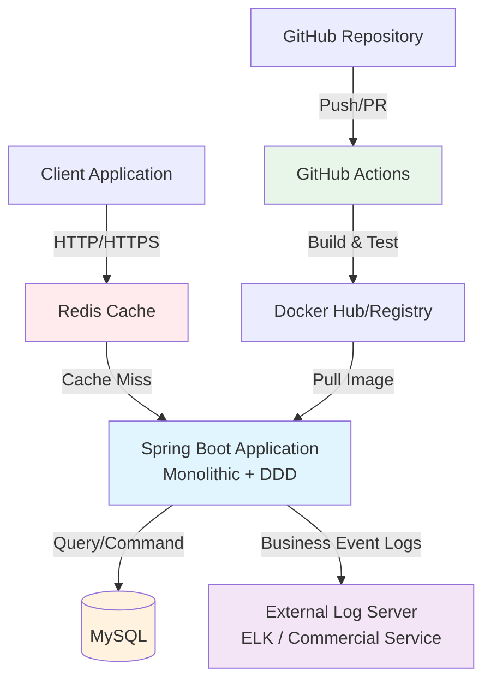
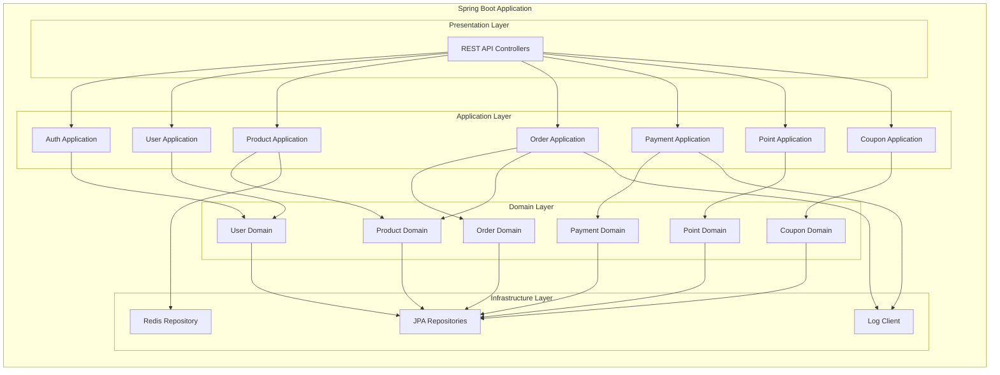
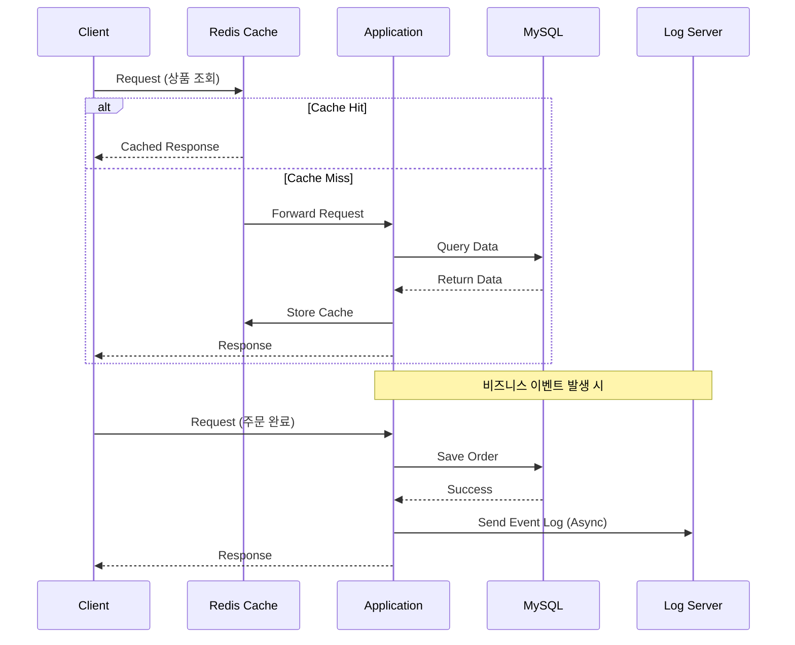

# Infrastructure Architecture

## System Architecture

## Component Details

### Application Layer (DDD)

## Request Flow

## Deployment Flow

```mermaid
graph LR
    Dev[Developer]
    Repo[GitHub Repository]
    Actions[GitHub Actions]
    Build[Build JAR]
    Test[Run Tests]
    DockerBuild[Build Docker Image]
    Registry[Docker Registry]
    Deploy[Deploy Container]
    Server[Application Server]
    
    Dev -->|Push Code| Repo
    Repo -->|Trigger| Actions
    Actions --> Build
    Build --> Test
    Test --> DockerBuild
    DockerBuild -->|Push Image| Registry
    Registry -->|Pull Image| Deploy
    Deploy --> Server
    
    style Actions fill:#e8f5e9
    style DockerBuild fill:#e1f5ff
    style Server fill:#fff3e0
```

## Technology Stack

### Application
- **Framework**: Spring Boot 3.x
- **Language**: Java 17+
- **Architecture**: Monolithic + DDD
- **ORM**: Spring Data JPA
- **Build**: Gradle

### Database
- **Primary DB**: MySQL 8.0
- **Cache**: Redis 7.x

### Infrastructure
- **Container**: Docker
- **CI/CD**: GitHub Actions
- **Logging**: ELK Stack / External Log Service

### Key Features
- **Caching Strategy**: Redis for product catalog, user sessions
- **Async Logging**: Non-blocking event logging to external service
- **Transaction Management**: Spring @Transactional
- **Concurrency Control**: Optimistic/Pessimistic Locking
