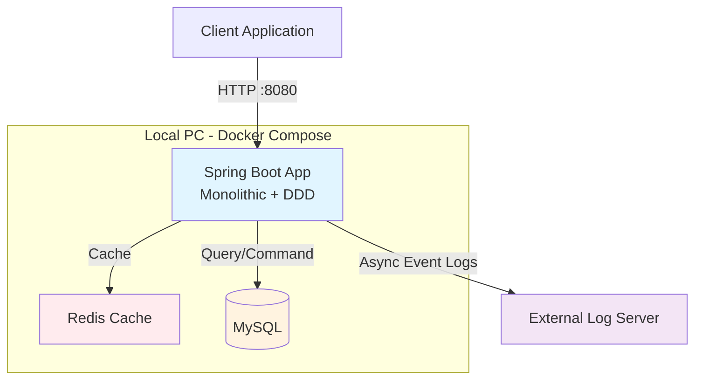
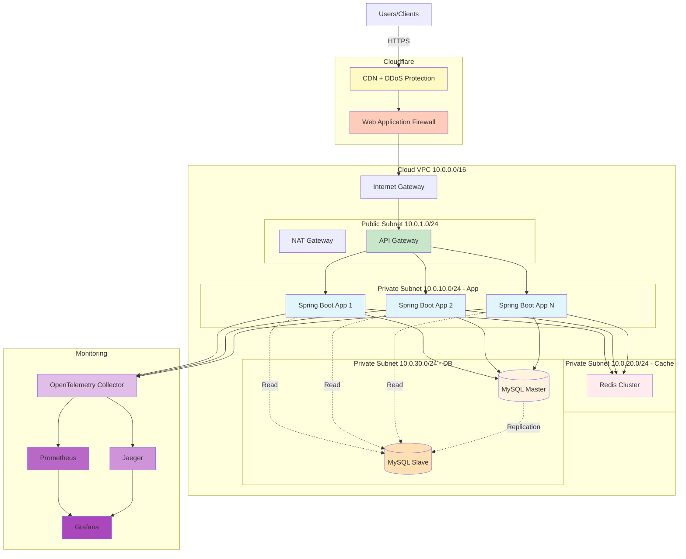
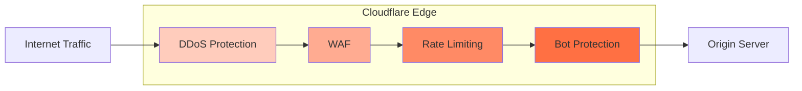
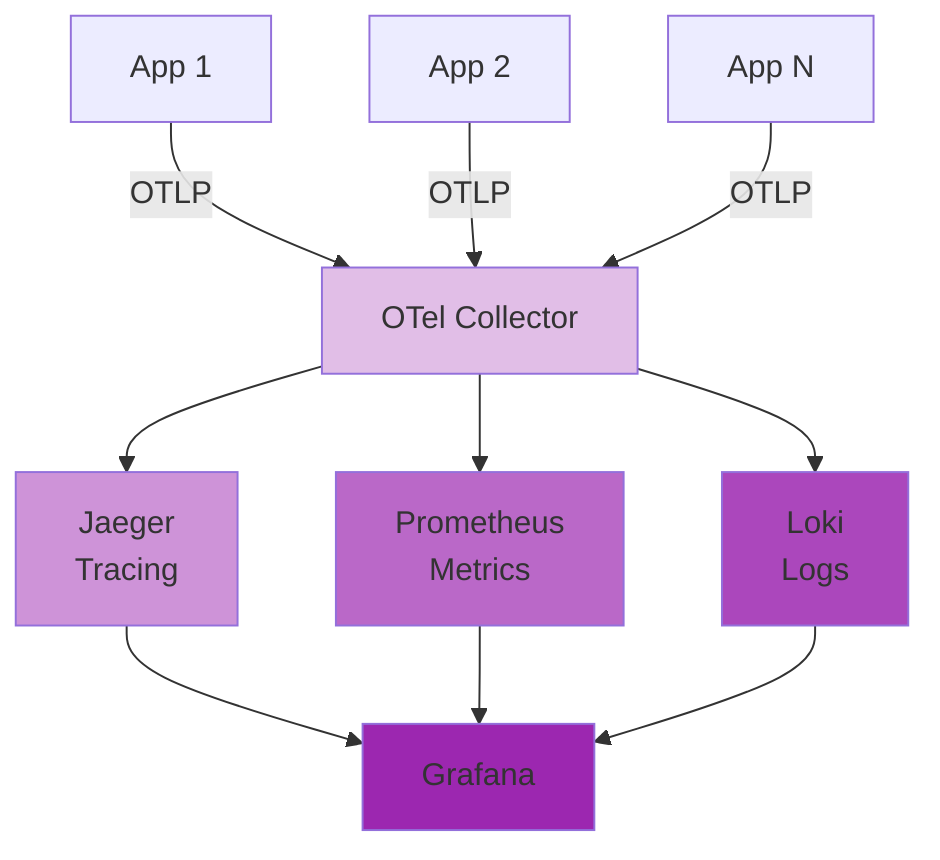
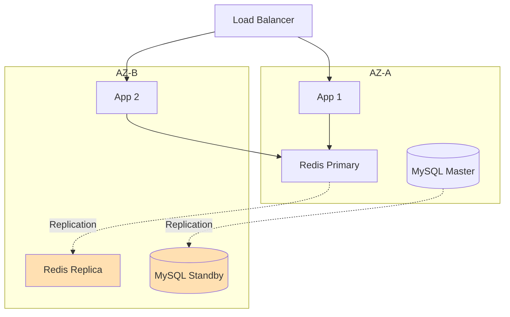
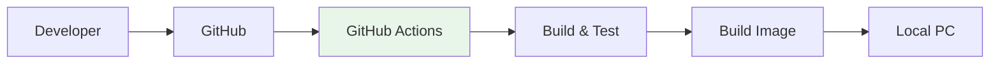
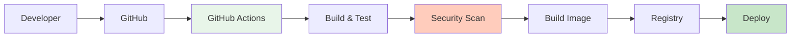

# Infrastructure Architecture

## Overview

이 문서는 HHPlus E-Commerce 시스템의 인프라 아키텍처를 설명합니다.
- **로컬 환경**: 개발/테스트용 Docker Compose 기반
- **클라우드 환경**: 프로덕션용 고가용성 클라우드 인프라

---

## Table of Contents
1. [Deployment Environments](#deployment-environments)
2. [Local Architecture](#local-architecture)
3. [Cloud Architecture](#cloud-architecture)
4. [Security](#security)
5. [Monitoring & Observability](#monitoring--observability)
6. [High Availability](#high-availability)
7. [Backup & Disaster Recovery](#backup--disaster-recovery)
8. [CI/CD](#cicd)
9. [Technology Stack](#technology-stack)
10. [Comparison](#comparison)

---

## Deployment Environments

### 1. Local Development (Current)
- 로컬 PC에 Docker Compose 기반 배포
- 개발 및 테스트 환경
- 단일 인스턴스 구성

### 2. Cloud Production (Future)
- Cloud VPC 기반 배포
- Cloudflare CDN + WAF 보안
- OpenTelemetry 모니터링
- Multi-AZ 고가용성
- Auto Scaling 확장성

---

## Local Architecture

### System Diagram



### Docker Compose Configuration

```yaml
version: '3.8'
services:
  app:
    image: ecommerce-api:latest
    ports:
      - "8080:8080"
    restart: always
    healthcheck:
      test: ["CMD", "curl", "-f", "http://localhost:8080/actuator/health"]
      interval: 30s
      timeout: 10s
      retries: 3
    depends_on:
      - mysql
      - redis
      
  mysql:
    image: mysql:8.0
    restart: always
    volumes:
      - ./mysql-data:/var/lib/mysql
      
  redis:
    image: redis:7
    restart: always
    volumes:
      - ./redis-data:/data
```

---

## Cloud Architecture

### System Diagram



---

## Security

### Cloudflare Security Layer



**기능:**
- DDoS Protection (Layer 3/4/7)
- WAF (OWASP Top 10 방어)
- Rate Limiting (100 req/min per IP)
- Bot Protection
- SSL/TLS 자동 관리

### Security Groups

```
ALB-SG:
  Inbound: 443 (HTTPS) from 0.0.0.0/0
  Outbound: 8080 to App-SG

App-SG:
  Inbound: 8080 from ALB-SG
  Outbound: 6379 to Redis-SG, 3306 to DB-SG

Redis-SG:
  Inbound: 6379 from App-SG only

DB-SG:
  Inbound: 3306 from App-SG only
```

---

## Monitoring & Observability

### OpenTelemetry Architecture



### Configuration

```yaml
# application.yml
management:
  otlp:
    tracing:
      endpoint: http://otel-collector:4318/v1/traces
  metrics:
    export:
      otlp:
        endpoint: http://otel-collector:4318/v1/metrics

otel:
  service:
    name: ecommerce-api
  resource:
    attributes:
      deployment.environment: production
```

### Grafana Dashboards

1. **Application Overview**: Request Rate, Error Rate, Response Time
2. **Service Health**: CPU, Memory, GC, Threads
3. **Database Performance**: Query Time, Connection Pool, Slow Queries
4. **Cache Performance**: Redis Hit Rate, Response Time
5. **Business Metrics**: Orders/min, Payment Success Rate
6. **Distributed Tracing**: Service Map, Trace Duration

### Alerting

```yaml
# Prometheus Alerts
- alert: HighErrorRate
  expr: rate(http_requests_total{status=~"5.."}[5m]) > 0.05
  
- alert: HighResponseTime
  expr: histogram_quantile(0.95, http_request_duration_seconds) > 3
  
- alert: DatabasePoolExhausted
  expr: hikaricp_connections_active / hikaricp_connections_max > 0.9
```

---

## High Availability

### Multi-AZ Deployment



### Auto Scaling

```yaml
Min Instances: 2
Max Instances: 10
Target CPU: 70%

Scale Out: CPU > 70% for 5 min
Scale In: CPU < 30% for 10 min
```

---

## Backup & Disaster Recovery

### Local Environment

**MySQL Backup:**
```bash
mysqldump -u root -p ecommerce > backup_$(date +%Y%m%d).sql
```

**Redis Backup:**
```bash
docker exec redis redis-cli BGSAVE
```

**Auto Restart:**
```yaml
services:
  app:
    restart: always
    healthcheck:
      test: ["CMD", "curl", "-f", "http://localhost:8080/actuator/health"]
```

### Cloud Environment

**Database (RDS):**
- 매일 자동 스냅샷
- Point-in-Time Recovery (35일)
- Multi-AZ 자동 복제

**Redis (ElastiCache):**
- 일일 자동 스냅샷
- Multi-AZ Auto-Failover

**Disaster Recovery:**
```
RPO: 1시간
RTO: 30분

절차:
1. 장애 감지 (자동)
2. 최신 백업 확인
3. 새 환경 복구
4. DNS 전환
```

---

## CI/CD

### Local Deployment



### Cloud Deployment



**Blue-Green Deployment:**
1. Green 환경에 새 버전 배포
2. 트래픽 점진적 전환 (10% → 50% → 100%)
3. 문제 시 즉시 Blue로 롤백

---

## Technology Stack

### Application
- Spring Boot 3.x, Java 17+
- Monolithic + DDD
- Spring Data JPA
- Gradle

### Database
- MySQL 8.0
- Redis 7.x

### Infrastructure

| 항목 | Local | Cloud |
|------|-------|-------|
| **Container** | Docker Compose | Docker / ECS |
| **Network** | Host Network | VPC, Security Groups |
| **Security** | 기본 | Cloudflare + WAF |
| **Monitoring** | 로그 확인 | OpenTelemetry + Grafana |
| **Database** | MySQL Container | RDS Multi-AZ |
| **Cache** | Redis Container | ElastiCache Multi-AZ |
| **Load Balancer** | - | Application Load Balancer |
| **Auto Scaling** | - | Target Tracking |
| **CI/CD** | Manual | GitHub Actions |

---

## Comparison

| 항목 | Local | Cloud |
|------|-------|-------|
| **환경** | 로컬 PC | AWS/GCP/Azure |
| **보안** | 기본 | Cloudflare + Security Groups |
| **모니터링** | 수동 로그 | OpenTelemetry + Grafana |
| **가용성** | Single Instance | Multi-AZ, 99.99% |
| **백업** | 수동 스크립트 | 자동 스냅샷 |
| **복구 시간** | 10-30분 | 1-5분 (자동) |
| **확장성** | 수동 증설 | Auto Scaling |
| **장애 대응** | 수동 재시작 | Auto Failover |
| **비용** | 무료 (HW만) | $590-1,330/월 |
| **용도** | 개발/테스트 | 프로덕션 |

---

## Cost Estimation (Cloud)

```
예상 월 비용:
  - Compute (3 instances): $150-300
  - RDS (Multi-AZ): $200-400
  - ElastiCache: $100-200
  - Load Balancer: $20-30
  - Data Transfer: $50-100
  - Cloudflare: $20-200
  - Monitoring: $50-100
  
Total: $590-1,330/month

최적화:
  - Reserved Instances (30-50% 절감)
  - Auto Scaling (유휴 리소스 제거)
  - S3 Lifecycle (로그 비용 절감)
```
