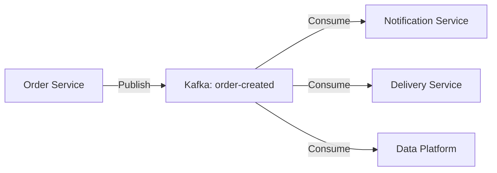

# Kafka 도입 및 확장 계획 (Future Plan)

## 1. 개요

본 문서는 현재 프로젝트 코드베이스 분석을 바탕으로, Kafka를 추가 도입하여 시스템 성능과 결합도를 개선할 수 있는 구체적인 영역을 정의합니다.

**분석 기준:**
- 동기 처리가 불필요한 구간 (Latency 개선)
- 트랜잭션 범위 밖의 부가 기능 (결합도 완화)
- 외부 시스템 연동 (장애 격리)

---

## 2. 도입 대상 및 상세 설계

### Target 1: 인기 상품 랭킹 업데이트 (최우선)

현재 `PaymentService`에서 결제 완료 시 동기적으로 Redis 랭킹을 업데이트하고 있습니다. 이를 비동기 Consumer로 분리합니다.

- **현재 위치:** `src/main/java/kr/hhplus/be/server/application/payment/PaymentService.java`
- **문제점:**
  - 결제 비즈니스 로직에 통계 로직(`updateProductRanking`)이 혼재됨
  - Redis 지연 발생 시 결제 API 응답 속도에 직접적인 영향
  - `try-catch`로 예외를 무시하고 있지만, 근본적인 해결책 아님

#### 개선 설계 (As-Is vs To-Be)

**As-Is (Synchronous)**
```java
@Transactional
public Payment executePayment(...) {
    // 1. 결제 처리
    payment.complete();
    
    // 2. 랭킹 업데이트 (동기 호출)
    // Redis 장애 시 지연 발생 가능
    productRankingRepository.incrementScore(...); 
    
    return payment;
}
```

**To-Be (Event-Driven)**
```java
// 1. PaymentService (Producer)
@Transactional
public Payment executePayment(...) {
    payment.complete();
    // Outbox 패턴으로 'PAYMENT_COMPLETED' 이벤트만 발행하고 종료
    return payment;
}

// 2. RankingConsumer (New)
@KafkaListener(topics = "payment-completed", groupId = "ranking-service")
public void updateRanking(PaymentCompletedEvent event) {
    // 별도 스레드에서 비동기 처리
    productRankingRepository.incrementScore(event.getProductId(), event.getQuantity());
}
```

---

### Target 2: 외부 데이터 플랫폼 연동

현재 `WebClientMessageProducer`를 통해 HTTP로 외부 API를 호출하는 구조를 Kafka Consumer 방식으로 전환합니다.

- **현재 위치:** `docs/WEBCLIENT_EXTERNAL_API.md`
- **문제점:**
  - 외부 시스템 장애 시 내부 서비스(Outbox Scheduler 등)에 부하 전파
  - HTTP 타임아웃, 재시도 로직을 직접 구현해야 함

#### 개선 설계

1. **Producer:** 내부 Kafka Topic (`order-created`, `payment-completed`)으로 이벤트 발행
2. **Consumer (Data Platform):**
   - 전용 Consumer Group (`data-platform-group`) 사용
   - 메시지를 읽어 외부 API로 전송
   - 실패 시 **Dead Letter Queue (DLQ)** 로 이동하여 후처리 보장

---

### Target 3: 주문 후처리 (알림/배송)

주문 생성(`ORDER_CREATED`) 이벤트의 활용 범위를 확장합니다.

- **현재 위치:** `src/main/java/kr/hhplus/be/server/application/order/OrderService.java`
- **활용 방안:**
  - **Notification Service:** 사용자에게 주문 완료 알림 (카카오톡/이메일)
  - **Delivery Service:** 배송 준비 상태 생성

**To-Be Architecture:**


---

## 3. 구현 단계 (Roadmap)

### Phase 1: 랭킹 업데이트 분리 (Refactoring)
1. `PaymentCompletedEvent`에 `List<OrderItem>` 정보가 포함되도록 DTO 확장 (또는 `orderId`로 조회)
2. `ProductRankingConsumer` 구현
3. `PaymentService` 내부의 `updateProductRanking` 메서드 제거

### Phase 2: 외부 연동 안정화
1. `WebClientMessageProducer` 사용 중단 (또는 Consumer 내부로 이동)
2. 외부 전송 실패 시 재시도 전략(Retry Topic) 수립

### Phase 3: MSA 준비
1. 각 도메인(주문, 결제, 상품) 간의 강한 결합을 느슨한 이벤트 기반으로 전환
2. `PAYLOAD_SELECTION_GUIDE.md`에 따라 메시지 포맷(String vs Object) 최적화

---

## 4. 참고 문서

- [Kafka Payload 선택 가이드](./PAYLOAD_SELECTION_GUIDE.md)
- [대규모 대기열 아키텍처](../queue/LARGE_SCALE_QUEUE_ARCHITECTURE.md)
- [WebClient 외부 API 연동](../WEBCLIENT_EXTERNAL_API.md)
