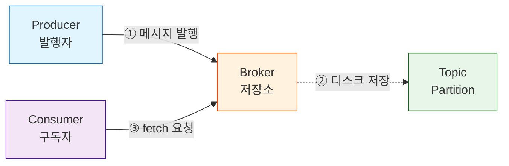
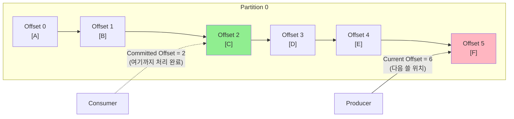

# Kafka 완벽 가이드 - 동료를 위한 쉬운 설명서

> 이벤트 드리븐 아키텍처를 위한 메시징 플랫폼, Apache Kafka

---

## 📌 Kafka란 무엇인가?

**Apache Kafka**는 **분산 이벤트 스트리밍 플랫폼**입니다.

쉽게 말하면:
- 대용량 실시간 데이터를 안정적으로 주고받을 수 있는 메시지 큐
- 데이터를 디스크에 저장하여 유실을 방지하는 내구성 있는 시스템
- 수평 확장이 가능한 분산 시스템

**핵심 특징:**
```
높은 처리량 + 낮은 지연시간 + 데이터 영속성 + 확장성
```

---

## 🎯 왜 Kafka를 사용해야 하는가?

### 1. 이벤트 드리븐 아키텍처의 핵심

현대 시스템은 **이벤트 중심**으로 설계됩니다:
```
주문 발생 → 이벤트 발행 → 재고 감소, 알림 발송, 분석 저장
```

Kafka는 이러한 이벤트를 **안정적으로 전달하고 저장**하는 중앙 허브 역할을 합니다.

### 2. 높은 처리량

- **초당 수백만 건의 메시지** 처리 가능
- 배치 처리와 압축으로 네트워크 효율 극대화
- 순차 디스크 I/O로 빠른 쓰기 성능

### 3. 메시지 유실 방지

**디스크 기반 저장 + Offset 관리**
```
RabbitMQ: 메모리 기반 → 서버 다운 시 메시지 손실 위험
Kafka:    디스크 저장 → 서버 재시작 후에도 메시지 보존
```

- 메시지를 디스크에 영구 저장 (설정 가능한 보관 기간)
- Consumer가 Offset을 관리하여 재처리 가능
- Replication으로 브로커 장애에도 안전

### 4. 실시간 스트림 처리

- 데이터가 발생하는 즉시 처리 가능
- Kafka Streams, ksqlDB로 실시간 분석
- 준실시간(Near Real-time) 처리 보장

### 5. 확장성

- 브로커 추가로 수평 확장
- 파티션 단위 병렬 처리
- Consumer Group으로 처리량 증가

---

## 🆚 RabbitMQ vs Kafka 비교

| 특성 | RabbitMQ | Kafka |
|------|----------|-------|
| **아키텍처** | 메시지 브로커 | 분산 로그 시스템 |
| **처리량** | 중간 (수만 msg/s) | 매우 높음 (수백만 msg/s) |
| **지연시간** | 낮음 (ms 단위) | 중간 (수십 ms) |
| **메시지 저장** | 메모리 (선택적 디스크) | 디스크 (필수) |
| **메시지 보관** | 소비 후 삭제 | 설정된 기간 동안 보관 |
| **재처리** | 어려움 | 쉬움 (Offset 이동) |
| **순서 보장** | 큐 단위 | 파티션 단위 |
| **확장성** | 수직 확장 중심 | 수평 확장 용이 |
| **사용 사례** | 작업 큐, RPC | 이벤트 스트리밍, 로그 수집 |

### 언제 RabbitMQ를 사용하나?
- 복잡한 라우팅 규칙이 필요할 때
- 낮은 지연시간이 중요할 때
- 메시지 소비 후 즉시 삭제가 필요할 때

### 언제 Kafka를 사용하나?
- 대용량 데이터 처리가 필요할 때
- 메시지 재처리가 필요할 때
- 여러 Consumer가 같은 데이터를 소비할 때
- 이벤트 소싱, 로그 수집, 실시간 분석

---

## 🏗️ Kafka 아키텍처

### 전체 구조



### 주요 컴포넌트

#### 1. Producer (프로듀서)
**역할:** 메시지를 Kafka에 발행

```java
// 예시
producer.send(new ProducerRecord<>("user-events", "user123", "login"));
                                    ↑ Topic      ↑ Key    ↑ Value
```

**주요 기능:**
- 메시지를 특정 Topic으로 전송
- Key 기반 파티셔닝 (같은 Key는 같은 파티션으로)
- 배치 처리 및 압축
- 멱등성 보장 (중복 방지)

#### 2. Broker (브로커)
**역할:** Kafka 서버 인스턴스

**주요 기능:**
- 메시지를 디스크에 저장
- Producer와 Consumer 요청 처리
- 파티션 리더/팔로워 관리
- 데이터 복제 (Replication)

**클러스터 구성:**
```
Broker 1 (Leader for P0)
Broker 2 (Leader for P1, Follower for P0)
Broker 3 (Leader for P2, Follower for P1)
```

#### 3. Consumer (컨슈머)
**역할:** 메시지를 가져와서 처리

```java
// 예시
consumer.subscribe(Arrays.asList("user-events"));
while (true) {
    ConsumerRecords<String, String> records = consumer.poll(Duration.ofMillis(100));
    for (ConsumerRecord<String, String> record : records) {
        processMessage(record.value());
    }
}
```

**주요 기능:**
- Topic 구독 (Subscribe)
- Offset 관리 (어디까지 읽었는지)
- Consumer Group으로 병렬 처리
- 자동/수동 커밋

---

## 📦 Kafka 핵심 개념

### 1. Topic (토픽)

**정의:** 메시지의 논리적 카테고리

```
Topic: "user-events"
- 사용자 관련 모든 이벤트를 담는 카테고리
- 로그인, 로그아웃, 프로필 수정 등
```

**특징:**
- 논리적 개념 (실제 저장 단위는 파티션)
- 여러 Producer가 같은 Topic에 발행 가능
- 여러 Consumer가 같은 Topic을 구독 가능

**네이밍 컨벤션:**
```
도메인.엔티티.이벤트타입
예: ecommerce.order.created
    ecommerce.order.cancelled
    analytics.user.pageview
```

### 2. Partition (파티션)

**정의:** Topic의 물리적 분할 단위

```
Topic: "user-events" (3 partitions)
├── Partition 0: [msg1, msg4, msg7, ...]
├── Partition 1: [msg2, msg5, msg8, ...]
└── Partition 2: [msg3, msg6, msg9, ...]
```

**왜 파티션이 필요한가?**

1. **병렬 처리**
   ```
   3개 파티션 = 최대 3개 Consumer 동시 처리 가능
   ```

2. **확장성**
   ```
   파티션을 늘리면 처리량 증가
   ```

3. **순서 보장**
   ```
   같은 파티션 내에서는 순서 보장
   (전체 Topic에서는 순서 보장 안 됨)
   ```

**파티셔닝 전략:**

```java
// 1. Key 기반 (같은 Key는 같은 파티션)
producer.send(new ProducerRecord<>("orders", "user123", orderData));
// user123의 모든 주문은 같은 파티션 → 순서 보장

// 2. Round-robin (Key 없을 때)
producer.send(new ProducerRecord<>("logs", null, logData));
// 파티션에 균등 분배

// 3. Custom Partitioner
class UserPartitioner implements Partitioner {
    public int partition(String topic, Object key, ...) {
        return hash(key) % numPartitions;
    }
}
```

**파티션 수 결정 시 고려사항:**

1. **Producer 처리량**: 초당 발행할 메시지 수
2. **Consumer 처리량**: Consumer 하나가 초당 처리 가능한 메시지 수 (보통 병목)
3. **Broker 처리량**: 브로커의 디스크/네트워크 한계

**계산 예시:**
```
Producer: 초당 10,000건 발행
Consumer 하나: 초당 1,000건 처리 (비즈니스 로직이 무거움)
Broker: 초당 100,000건 처리 가능 (병목 아님)

→ Consumer가 병목 → 최소 10개 파티션 필요
→ 여유를 두고 12~15개 파티션 권장
```

**주의:**
- Consumer 처리 로직이 무거울수록 더 많은 파티션 필요
- 파티션 수 = Consumer Group 내 최대 병렬 처리 수
- 파티션은 증가만 가능, 감소 불가 → 초기 설계 중요

### 3. Offset (오프셋)

**정의:** 파티션 내 메시지의 고유 번호



**Offset 종류:**

1. **Current Offset (Log End Offset, LEO)**
   - Producer가 다음에 쓸 위치
   - 파티션에 저장된 마지막 메시지 + 1

2. **Committed Offset**
   - Consumer가 처리 완료하고 커밋한 오프셋
   - `__consumer_offsets` 토픽에 저장

3. **Consumer Lag**
   ```
   Lag = Current Offset - Committed Offset
   
   예: Current Offset = 6, Committed Offset = 2
       → Lag = 4 (처리 대기 중인 메시지 4개)
   ```

**특징:**
- 파티션마다 독립적으로 증가 (0부터 시작)
- 불변 (Immutable)
- Consumer가 Offset을 관리하여 재처리 가능

**메시지 저장 vs Offset 저장:**

| 구분 | 메시지 데이터 | Consumer Offset |
|------|--------------|-----------------|
| **저장 위치** | 브로커 디스크 (파티션 로그) | `__consumer_offsets` 토픽 |
| **관리 주체** | Broker | Consumer Group |
| **보관 정책** | Retention 정책 (시간/크기) | Compaction (최신 값만 유지) |

**Retention 정책 (메시지 보관):**
```properties
# 시간 기반 (기본 7일)
log.retention.hours=168

# 크기 기반
log.retention.bytes=1073741824  # 1GB

# 영구 보관
log.retention.ms=-1
```

**Offset 커밋 방식:**

1. **자동 커밋 (Auto Commit)**
```java
enable.auto.commit=true
auto.commit.interval.ms=5000  // 5초마다 자동 커밋
```
- Consumer가 `poll()`로 메시지를 가져온 후 5초마다 자동 커밋
- 처리 완료 여부와 무관하게 시간 기반으로 커밋
- **위험**: 메시지를 가져왔지만 처리 중 장애 발생 시 → 이미 커밋되어 메시지 유실

2. **수동 커밋 (Manual Commit) - 권장**
```java
enable.auto.commit=false
consumer.commitSync();  // 처리 완료 후 명시적 커밋
```
- Consumer가 메시지를 처리 완료한 후 명시적으로 커밋
- 처리 성공을 확인한 후에만 커밋
- **장점**: 메시지 유실 방지 (At-Least-Once 보장)

**재처리 시나리오:**
```
1. Consumer가 Offset 2까지 처리 완료
2. Consumer 장애 발생
3. Consumer 재시작
4. Committed Offset = 2부터 다시 읽기 시작
→ 메시지 유실 없음
```

### 4. Consumer Group (컨슈머 그룹)

**정의:** 협력하여 메시지를 소비하는 Consumer들의 그룹

#### 1) 기본 규칙

```
Topic: 3개 파티션 (P0, P1, P2)

Consumer Group A (3 consumers)
├── Consumer 1 → Partition 0
├── Consumer 2 → Partition 1
└── Consumer 3 → Partition 2

Consumer Group B (2 consumers)
├── Consumer 1 → Partition 0, 1
└── Consumer 2 → Partition 2
```

**핵심 규칙:**
- **같은 Consumer Group 내에서**: 하나의 파티션은 하나의 Consumer만 읽을 수 있음
- **하나의 Consumer는**: 여러 파티션을 읽을 수 있음

**Consumer 수 vs 파티션 수:**
- Consumer 수 = 파티션 수: 이상적 (1:1 매칭)
- Consumer 수 < 파티션 수: 한 Consumer가 여러 파티션 처리
- Consumer 수 > 파티션 수: 일부 Consumer는 유휴 상태

#### 2) 다른 그룹 간 독립성

**다른 Consumer Group은 같은 파티션을 독립적으로 읽을 수 있음**

```
Topic: "order-created"

Consumer Group: "inventory-service"
→ 재고 감소 처리

Consumer Group: "notification-service"  
→ 주문 확인 알림 발송

Consumer Group: "analytics-service"
→ 주문 데이터 분석

→ 같은 주문 이벤트를 3개 서비스가 독립적으로 처리
```

#### 3) 순서 보장 문제와 해결책

**해결: Key 기반 파티셔닝**
```java
// user123의 모든 주문은 같은 파티션으로
producer.send(new ProducerRecord<>("orders", "user123", orderData));
```

**멱등성 (Idempotency):**
- **정의**: 같은 요청을 여러 번 해도 결과가 동일
- **효과**: 순서 문제 + 중복 처리 문제 모두 해결

### 5. Replication (복제)

**정의:** 데이터 안정성을 위한 복제본

#### 1) Leader와 Follower

```
Topic: "orders" (RF=3)
Partition 0:
├── Leader (Broker 1)     ← 읽기/쓰기 처리
├── Follower (Broker 2)   ← 복제본
└── Follower (Broker 3)   ← 복제본
```

**역할:**
- **Leader**: 모든 읽기/쓰기 요청 처리
- **Follower**: Leader로부터 데이터 복제, 대기 상태

**권장 설정:**
- 프로덕션: RF=3 (최소 2)
- 개발/테스트: RF=1

#### 2) ISR (In-Sync Replica)

**정의:** Leader와 동기화된 복제본 목록

**왜 중요한가?**
- Leader 장애 시 ISR 중에서만 새 Leader 선출
- 데이터 일관성 보장

#### 3) ACK 설정 (Producer)

```properties
# acks=0: 응답 기다리지 않음 (빠름, 유실 가능)
acks=0

# acks=1: Leader만 저장 확인 (기본)
acks=1

# acks=all: 모든 ISR 저장 확인 (안전, 느림)
acks=all
min.insync.replicas=2
```

**권장 설정 (프로덕션):**
```properties
acks=all
min.insync.replicas=2
replication.factor=3
```

### 6. Rebalancing (리밸런싱)

**정의:** Consumer Group 내에서 파티션을 Consumer들에게 재할당하는 과정

#### 발생 시점
1. Consumer 추가 (스케일 아웃)
2. Consumer 제거 또는 장애
3. Consumer가 `max.poll.interval.ms` 내에 poll() 호출 안 함
4. Topic의 파티션 수 변경

#### 해결 방법

**1. ConsumerRebalanceListener 사용**
```java
consumer.subscribe(topics, new ConsumerRebalanceListener() {
    @Override
    public void onPartitionsRevoked(Collection<TopicPartition> partitions) {
        consumer.commitSync();
    }
    
    @Override
    public void onPartitionsAssigned(Collection<TopicPartition> partitions) {
        // 새 파티션 할당
    }
});
```

**2. Cooperative Rebalancing 사용**
```properties
partition.assignment.strategy=org.apache.kafka.clients.consumer.CooperativeStickyAssignor
```

---

## 💡 Kafka의 핵심 기능

### 1. 멱등성 (Idempotence)

```properties
enable.idempotence=true
```

### 2. 트랜잭션 (Transactions)

```java
producer.initTransactions();
producer.beginTransaction();
try {
    producer.send(record1);
    producer.send(record2);
    producer.commitTransaction();
} catch (Exception e) {
    producer.abortTransaction();
}
```

### 3. Exactly Once Semantics (EOS)

```properties
# Producer
enable.idempotence=true
transactional.id=my-app

# Consumer
isolation.level=read_committed
```

---

## 🎯 실전 사용 사례

### 1. 이벤트 소싱
```
사용자 행동 추적:
user-login → user-pageview → user-click → user-purchase
```

### 2. 마이크로서비스 통신
```
Order Service → order-created → Kafka
                                  ↓
                    ┌─────────────┼─────────────┐
                    ↓             ↓             ↓
            Inventory      Notification    Analytics
            Service        Service         Service
```

### 3. CDC (Change Data Capture)
```
Database → Debezium → Kafka → Data Warehouse
```

---

## ⚠️ Kafka의 한계와 주의사항

### 단점
1. **복잡한 운영**: ZooKeeper 관리 필요 (KRaft로 개선 중)
2. **지연시간**: RabbitMQ보다 높은 지연시간 (수십 ms)
3. **메시지 순서**: 파티션 내에서만 순서 보장
4. **파티션 재조정 불가**: 파티션 수 감소 불가 (증가만 가능)

### 주의사항
1. **파티션 수 설계**: 초기 설계가 중요
2. **Consumer Lag 모니터링**: Lag이 계속 증가 → Consumer 처리 속도 부족
3. **메시지 크기 제한**: 기본 1MB 제한

---

**작성일:** 2026-01-27  
**버전:** v2.0
