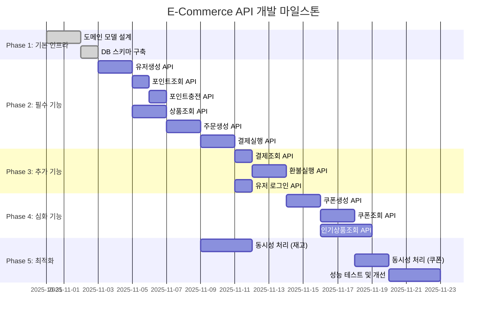

# E-Commerce Project Milestone

## 프로젝트 일정



## Phase 1: 기본 인프라 (3일)

### 도메인 모델 설계 (1일)
- [x] **Entity 설계**
  - User: id, email, name, created_at
  - Product: id, name, price, stock, status, created_at
  - Order: id, user_id, total_amount, final_amount, paid_amount, status, created_at
  - OrderItem: id, order_id, product_id, quantity, price
  - Payment: id, order_id, amount, status, payment_method, created_at
  - Point: id, user_id, balance, updated_at
- [x] **Aggregate 경계 정의**
  - Order Aggregate: Order + OrderItem
  - User Aggregate: User + Point
  - Product Aggregate: Product (단독)
- [x] **연관관계 설정**
  - 직접참조: Order ↔ OrderItem (집합관계)
  - ID참조: OrderItem → Product, Order → User

### ERD 및 DB 스키마 (1일)
- [x] **ERD 다이어그램 작성** (Mermaid)
- [x] **제약조건 정의**
  - `CHECK (product.price >= 0)`
  - `CHECK (product.stock >= 0)`
  - `CHECK (order.total_amount > 0)`
  - `CHECK (point.balance >= 0)`
- [x] **인덱스 설계**
  - `products(created_at, status)`
  - `orders(user_id, created_at)`
  - `order_items(order_id, product_id)`
  - `payments(order_id, status)`
- [x] **Flyway 마이그레이션 스크립트**
  - V1__create_users_table.sql
  - V2__create_products_table.sql
  - V3__create_orders_table.sql
  - V4__create_payments_table.sql
  - V5__create_points_table.sql

### Docker 환경 구성 (1일)
- [x] **docker-compose.yml 작성**
  - MySQL 8.0 (port: 3306)
  - Redis 7.0 (port: 6379)
  - 볼륨 마운트 설정
- [x] **application.yml 프로파일 설정**
  - local, dev, prod 프로파일
  - 데이터소스 설정
  - JPA 설정 (ddl-auto: validate)
- [x] **초기 데이터 준비** (data.sql)
  - 테스트용 유저 10명
  - 테스트용 상품 20개

## Phase 2: 필수 기능 (11일)

### 유저생성 API (2일)
- [ ] **API 엔드포인트**
  - `POST /api/users` - 유저 생성
  - `GET /api/users/{userId}` - 유저 조회
- [ ] **구현 내용**
  - UserController, UserService, UserRepository
  - CreateUserRequest/Response DTO
  - 이메일 중복 검증
  - 입력값 검증 (@Valid, @NotBlank)
- [ ] **예외 처리**
  - DuplicateEmailException (409 Conflict)
  - InvalidInputException (400 Bad Request)
- [ ] **테스트**
  - 단위 테스트: UserService 로직
  - 통합 테스트: API 호출 (RestAssured)
  - Postman Collection 작성

### 포인트조회 API (1일)
- [ ] **API 엔드포인트**
  - `GET /api/users/{userId}/points` - 포인트 조회
- [ ] **구현 내용**
  - PointController, PointService, PointRepository
  - PointResponse DTO
  - User와 Point 1:1 관계 설정
- [ ] **비즈니스 로직**
  - 유저 존재 여부 확인
  - 포인트 없으면 0으로 초기화
- [ ] **테스트**
  - 정상 조회 케이스
  - 존재하지 않는 유저 (404)

### 포인트충전 API (1일)
- [ ] **API 엔드포인트**
  - `POST /api/users/{userId}/points/charge` - 포인트 충전
- [ ] **구현 내용**
  - ChargePointRequest DTO (amount)
  - Point.charge(amount) 도메인 메서드
  - @Transactional 적용
- [ ] **비즈니스 로직**
  - 충전 금액 검증 (최소 1,000원, 최대 1,000,000원)
  - 잔액 업데이트 (balance += amount)
  - 충전 이력 기록 (PointHistory 테이블)
- [ ] **동시성 고려**
  - 낙관적 락 (@Version) 적용
  - 충돌 시 재시도 로직
- [ ] **테스트**
  - 정상 충전
  - 금액 검증 실패 (400)
  - 동시 충전 시나리오 (10 스레드)

### 상품조회 API (2일)
- [ ] **API 엔드포인트**
  - `GET /api/products` - 상품 목록 조회 (페이징)
  - `GET /api/products/{productId}` - 상품 상세 조회
  - `POST /api/products` - 상품 생성 (관리자)
- [ ] **구현 내용**
  - ProductController, ProductService, ProductRepository
  - ProductResponse DTO
  - Pageable 적용 (size: 20)
- [ ] **비즈니스 로직**
  - 상품 상태 필터링 (ACTIVE만 조회)
  - 재고 0인 상품 표시
  - 가격 정렬 옵션
- [ ] **재고 관리**
  - Product.decreaseStock(quantity) 메서드
  - 재고 부족 예외 (InsufficientStockException)
  - CHECK 제약조건 (stock >= 0)
- [ ] **캐싱**
  - Redis 캐싱 적용 (상품 목록)
  - TTL: 5분
  - @Cacheable 어노테이션
- [ ] **테스트**
  - 목록 조회 (페이징)
  - 상세 조회
  - 재고 감소 로직
  - 재고 부족 시나리오

### 주문생성 API (2일)
- [ ] **API 엔드포인트**
  - `POST /api/orders` - 주문 생성
  - `GET /api/orders/{orderId}` - 주문 조회
- [ ] **구현 내용**
  - OrderController, OrderService, OrderRepository
  - CreateOrderRequest DTO (userId, items[], usePoint)
  - OrderResponse DTO (order + orderItems)
- [ ] **비즈니스 로직**
  - 주문 생성 플로우
    1. 상품 존재 및 재고 확인
    2. 재고 차감 (Product.decreaseStock)
    3. 주문 금액 계산
    4. 포인트 사용 처리
    5. Order + OrderItem 저장
  - 금액 계산
    - total_amount = Σ(상품가격 × 수량)
    - final_amount = total_amount - usePoint
    - 최소 주문 금액: 1,000원
- [ ] **트랜잭션 관리**
  - @Transactional 적용
  - 재고 차감 실패 시 전체 롤백
  - 격리 수준: READ_COMMITTED
- [ ] **동시성 처리**
  - 재고 차감에 비관적 락 적용
  - `@Lock(LockModeType.PESSIMISTIC_WRITE)`
  - 락 타임아웃: 5초
- [ ] **예외 처리**
  - 상품 없음 (404)
  - 재고 부족 (400)
  - 포인트 부족 (400)
  - 최소 금액 미달 (400)
- [ ] **테스트**
  - 정상 주문 생성
  - 재고 차감 확인
  - 포인트 차감 확인
  - 동시 주문 시나리오 (50 스레드)
  - 재고 정합성 검증

### 결제실행 API (2일)
- [ ] **API 엔드포인트**
  - `POST /api/payments` - 결제 실행
  - `GET /api/payments/{paymentId}` - 결제 조회
- [ ] **구현 내용**
  - PaymentController, PaymentService, PaymentRepository
  - CreatePaymentRequest DTO (orderId, paymentMethod)
  - PaymentResponse DTO
- [ ] **비즈니스 로직**
  - 결제 실행 플로우
    1. 주문 존재 확인
    2. 주문 상태 확인 (PENDING만 결제 가능)
    3. 결제 금액 = order.final_amount
    4. 결제 처리 (외부 PG 연동 가정)
    5. 결제 상태 업데이트 (SUCCESS/FAILED)
    6. 주문 상태 업데이트 (PAID)
- [ ] **결제 상태 관리**
  - PENDING → SUCCESS
  - PENDING → FAILED
  - 상태 전이 검증
- [ ] **멱등성 보장**
  - 동일 주문 중복 결제 방지
  - 결제 완료된 주문 재결제 차단
- [ ] **트랜잭션 관리**
  - @Transactional 적용
  - 결제 실패 시 롤백 (재고는 유지)
- [ ] **예외 처리**
  - 주문 없음 (404)
  - 이미 결제됨 (409)
  - 결제 실패 (500)
- [ ] **테스트**
  - 정상 결제
  - 중복 결제 방지
  - 결제 실패 시나리오
  - 주문 상태 변경 확인

## Phase 3: 추가 기능 (4일)

### 결제조회 API (1일)
- [ ] **API 엔드포인트**
  - `GET /api/payments/{paymentId}` - 결제 상세 조회
  - `GET /api/orders/{orderId}/payments` - 주문별 결제 내역
  - `GET /api/users/{userId}/payments` - 유저별 결제 내역
- [ ] **구현 내용**
  - 결제 상세 정보 조회
  - 결제 이력 조회 (페이징)
  - 결제 상태별 필터링
- [ ] **테스트**
  - 결제 조회
  - 존재하지 않는 결제 (404)
  - 페이징 동작 확인

### 환불실행 API (2일)
- [ ] **API 엔드포인트**
  - `POST /api/payments/{paymentId}/refund` - 환불 실행
- [ ] **구현 내용**
  - RefundRequest DTO (reason)
  - RefundService 구현
- [ ] **비즈니스 로직**
  - 환불 실행 플로우
    1. 결제 존재 및 상태 확인 (SUCCESS만 환불 가능)
    2. 환불 가능 기간 확인 (결제 후 7일 이내)
    3. 재고 복구 (Product.increaseStock)
    4. 포인트 환불 (Point.refund)
    5. 결제 상태 업데이트 (REFUNDED)
    6. 주문 상태 업데이트 (CANCELLED)
- [ ] **트랜잭션 관리**
  - @Transactional 적용
  - 재고 복구 실패 시 전체 롤백
- [ ] **예외 처리**
  - 결제 없음 (404)
  - 이미 환불됨 (409)
  - 환불 기간 초과 (400)
- [ ] **테스트**
  - 정상 환불
  - 재고 복구 확인
  - 포인트 환불 확인
  - 중복 환불 방지
  - 환불 기간 검증

### 유저 로그인 API (1일)
- [ ] **API 엔드포인트**
  - `POST /api/auth/login` - 로그인
  - `POST /api/auth/logout` - 로그아웃
- [ ] **구현 내용**
  - AuthController, AuthService
  - LoginRequest DTO (email, password)
  - JWT 토큰 생성 (jjwt 라이브러리)
- [ ] **인증 로직**
  - 이메일/비밀번호 검증
  - JWT 토큰 발급 (유효기간: 1시간)
  - Refresh Token 발급 (유효기간: 7일)
- [ ] **보안 설정**
  - Spring Security 설정
  - JWT 필터 구현
  - 비밀번호 암호화 (BCrypt)
- [ ] **테스트**
  - 정상 로그인
  - 잘못된 비밀번호 (401)
  - 존재하지 않는 유저 (404)
  - 토큰 검증

## Phase 4: 심화 기능 (7일)

### 쿠폰생성 API (2일)
- [ ] **API 엔드포인트**
  - `POST /api/coupons` - 쿠폰 생성 (관리자)
  - `GET /api/coupons/{couponId}` - 쿠폰 조회
- [ ] **구현 내용**
  - CouponController, CouponService, CouponRepository
  - Coupon 엔티티 (id, name, discount_type, discount_value, quantity, issued_count, start_date, end_date)
  - CreateCouponRequest DTO
- [ ] **쿠폰 타입**
  - FIXED_AMOUNT: 고정 금액 할인
  - PERCENTAGE: 비율 할인
  - FIRST_COME: 선착순 쿠폰
- [ ] **비즈니스 로직**
  - 쿠폰 수량 관리
  - 유효기간 검증
  - 할인 금액 계산
- [ ] **테스트**
  - 쿠폰 생성
  - 쿠폰 조회
  - 유효기간 검증

### 쿠폰조회 API (2일)
- [ ] **API 엔드포인트**
  - `POST /api/coupons/{couponId}/issue` - 쿠폰 발급
  - `GET /api/users/{userId}/coupons` - 내 쿠폰 조회
  - `POST /api/coupons/{couponId}/use` - 쿠폰 사용
- [ ] **구현 내용**
  - UserCoupon 엔티티 (user_id, coupon_id, status, issued_at, used_at)
  - 쿠폰 발급 로직
  - 쿠폰 사용 로직
- [ ] **선착순 쿠폰 처리**
  - Redis 카운터 사용
  - `INCR coupon:{couponId}:issued`
  - 수량 초과 시 발급 차단
- [ ] **동시성 제어**
  - Redisson 분산 락 적용
  - `RLock lock = redisson.getLock("coupon:" + couponId)`
  - 락 타임아웃: 3초, 대기: 5초
- [ ] **비즈니스 로직**
  - 쿠폰 발급 플로우
    1. 쿠폰 존재 및 유효기간 확인
    2. 수량 확인 (issued_count < quantity)
    3. 중복 발급 방지 (유저당 1회)
    4. Redis 카운터 증가
    5. UserCoupon 저장
    6. issued_count 증가
- [ ] **예외 처리**
  - 쿠폰 없음 (404)
  - 수량 소진 (409)
  - 중복 발급 (409)
  - 유효기간 만료 (400)
- [ ] **테스트**
  - 정상 발급
  - 선착순 동시성 테스트 (1000 스레드)
  - 정확히 quantity만큼만 발급 확인
  - 중복 발급 방지

### 인기상품조회 API (3일)
- [ ] **API 엔드포인트**
  - `GET /api/products/popular` - 인기 상품 조회
  - `GET /api/products/popular/weekly` - 주간 인기 상품
- [ ] **구현 내용**
  - PopularProduct 엔티티 (product_id, score, rank, period, updated_at)
  - PopularProductService
- [ ] **인기도 계산 알고리즘**
  - 최근 3일간 판매량 기준
  - 인기도 점수 = 판매량 × 0.7 + 조회수 × 0.3
  - 상위 10개 상품 선정
  - 일별/주별 집계
- [ ] **Spring Batch 구현**
  - PopularProductJob 생성
  - ItemReader: 주문 데이터 조회 (최근 3일)
    ```java
    JpaPagingItemReader<Order>
    - pageSize: 100
    - queryString: "SELECT o FROM Order o WHERE o.createdAt >= :startDate"
    ```
  - ItemProcessor: 인기도 점수 계산
    ```java
    - 상품별 판매량 집계
    - 조회수 조회 (Redis)
    - 점수 계산 및 순위 결정
    ```
  - ItemWriter: popular_products 테이블 저장
    ```java
    JpaItemWriter<PopularProduct>
    ```
  - Chunk size: 100
- [ ] **스케줄링**
  - `@Scheduled(cron = "0 0 1 * * *")` - 매일 새벽 1시
  - `@Scheduled(cron = "0 0 2 * * MON")` - 매주 월요일 새벽 2시
- [ ] **캐싱**
  - Redis 캐싱 (TTL: 1시간)
  - 배치 실행 후 캐시 갱신
- [ ] **테스트**
  - 배치 Job 실행
  - 인기도 점수 계산 검증
  - 순위 정렬 확인
  - API 조회 테스트

## Phase 5: 최적화 (8일)

### 재고 수량 동시성 처리 (3일)
- [ ] **동시성 전략 선택**
  - 비관적 락 (Pessimistic Lock) 선택
  - 이유: 재고는 충돌 가능성 높음, 정합성 최우선
- [ ] **구현**
  - ProductRepository에 락 적용
    ```java
    @Lock(LockModeType.PESSIMISTIC_WRITE)
    @Query("SELECT p FROM Product p WHERE p.id = :id")
    Optional<Product> findByIdWithLock(@Param("id") Long id);
    ```
  - 락 타임아웃 설정
    ```yaml
    spring.jpa.properties.javax.persistence.lock.timeout: 5000
    ```
- [ ] **데드락 방지**
  - 락 획득 순서 일관성 유지
  - 타임아웃 설정
  - 재시도 로직 (최대 3회)
- [ ] **테스트**
  - JUnit 동시성 테스트
    ```java
    ExecutorService executor = Executors.newFixedThreadPool(100);
    CountDownLatch latch = new CountDownLatch(100);
    // 100개 스레드 동시 재고 차감
    ```
  - 재고 정합성 검증
  - 응답시간 측정 (< 1초)

### 선착순 쿠폰 동시성 처리 (2일)
- [ ] **동시성 전략 선택**
  - Redis 분산 락 (Redisson) 선택
  - 이유: 높은 동시성, 빠른 응답 필요
- [ ] **구현**
  - Redisson 설정
    ```java
    @Bean
    public RedissonClient redissonClient() {
        Config config = new Config();
        config.useSingleServer().setAddress("redis://localhost:6379");
        return Redisson.create(config);
    }
    ```
  - 쿠폰 발급에 락 적용
    ```java
    RLock lock = redissonClient.getLock("coupon:" + couponId);
    try {
        if (lock.tryLock(5, 3, TimeUnit.SECONDS)) {
            // 쿠폰 발급 로직
        }
    } finally {
        lock.unlock();
    }
    ```
- [ ] **Redis 카운터 활용**
  - `INCR coupon:{couponId}:issued`
  - 원자적 연산으로 정합성 보장
- [ ] **테스트**
  - JMeter 부하 테스트
    - 1000 스레드 동시 요청
    - 쿠폰 수량: 100개
    - 정확히 100개만 발급 확인

### 성능 테스트 및 개선 (3일)
- [ ] **JMeter 부하 테스트**
  - 테스트 시나리오 1: 주문 생성
    - Thread: 200, Ramp-up: 10초, Loop: 10
    - 목표: 평균 응답시간 < 500ms
  - 테스트 시나리오 2: 상품 조회
    - Thread: 500, Ramp-up: 5초, Loop: 20
    - 목표: 평균 응답시간 < 200ms
  - 테스트 시나리오 3: 쿠폰 발급
    - Thread: 1000, Ramp-up: 1초, Loop: 1
    - 목표: 정합성 100%
- [ ] **성능 모니터링**
  - VisualVM으로 CPU/메모리 프로파일링
  - Spring Actuator 메트릭 수집
  - Slow Query 로그 분석
- [ ] **최적화 작업**
  - N+1 쿼리 제거
    - fetch join 적용
    - `@EntityGraph` 사용
  - 인덱스 추가
    - `CREATE INDEX idx_products_created_status ON products(created_at, status)`
    - `CREATE INDEX idx_orders_user_created ON orders(user_id, created_at)`
    - `CREATE INDEX idx_order_items_order_product ON order_items(order_id, product_id)`
  - Redis 캐싱
    - 상품 목록 (TTL: 5분)
    - 인기 상품 (TTL: 1시간)
    - `@Cacheable("products")`
  - 커넥션 풀 튜닝
    ```yaml
    spring.datasource.hikari:
      maximum-pool-size: 20
      minimum-idle: 10
      connection-timeout: 30000
      idle-timeout: 600000
    ```
  - JVM 옵션
    ```
    -Xms512m -Xmx2g
    -XX:+UseG1GC
    -XX:MaxGCPauseMillis=200
    ```
- [ ] **재테스트**
  - 최적화 후 JMeter 재실행
  - 성능 개선율 측정
  - 목표 달성 확인

## 총 예상 기간: 약 5주

## 기술 스택

### Backend
- Java 17
- Spring Boot 3.x
- Spring Data JPA
- Spring Security
- Spring Batch 5.x

### Database
- MySQL 8.0
- Redis 7.0
- Flyway (마이그레이션)

### 동시성 제어
- JPA Pessimistic Lock (재고)
- Redisson 분산 락 (쿠폰)
- Redis 원자적 연산 (카운터)

### 테스트
- JUnit 5
- Mockito
- RestAssured
- Testcontainers
- Apache JMeter 5.6

### 모니터링
- Spring Actuator
- VisualVM
- Slow Query Log

### 빌드 & 배포
- Gradle
- Docker & Docker Compose

## 성능 목표

### 응답시간
- 상품 조회: < 200ms
- 주문 생성: < 500ms
- 결제 실행: < 500ms
- 쿠폰 발급: < 300ms

### 처리량
- 동시 사용자: 200명
- TPS: 200 이상
- 재고 동시성: 100 스레드 정합성 보장
- 쿠폰 선착순: 1000 동시 요청 처리

### 가용성
- 데이터 정합성: 100%
- 트랜잭션 성공률: > 99%

## 주요 기술적 고려사항

### DDD 아키텍처
- Aggregate 경계 명확화
- 도메인 객체 책임 분리
- 직접참조 vs ID참조 전략

### 동시성 제어
- 재고: 비관적 락 (정합성 우선)
- 쿠폰: Redis 분산 락 (성능 우선)
- 포인트: 낙관적 락 (충돌 적음)

### 트랜잭션 관리
- 격리 수준: READ_COMMITTED
- 트랜잭션 경계 최소화
- 롤백 전략 명확화

### 성능 최적화
- N+1 쿼리 제거
- 적절한 인덱스 설계
- Redis 캐싱 전략
- 커넥션 풀 튜닝

## 위험 요소 및 대응

### 동시성 이슈
- 위험: 재고/쿠폰 정합성 깨짐
- 대응: 락 전략 + 충분한 테스트

### 성능 저하
- 위험: 높은 부하 시 응답시간 증가
- 대응: 캐싱, 인덱스, 커넥션 풀 최적화

### 데드락
- 위험: 비관적 락 사용 시 데드락 발생
- 대응: 락 타임아웃, 락 순서 일관성

### 배치 실패
- 위험: 인기상품 배치 실패 시 데이터 누락
- 대응: 재시도 로직, 실패 알림
