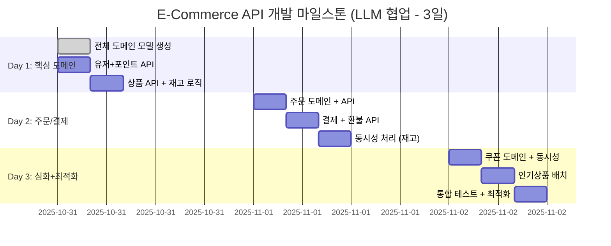

# E-Commerce Project Milestone (with LLM)

## LLM 협업 워크플로우 - 3일 스프린트



## LLM 활용 전략 (초고속 개발)

### Day 1: 핵심 도메인 (12시간)

#### 오전: 전체 도메인 모델 생성 (4h)
- [x] **09:00-10:00 | 개발자**: LLM과 전체 Entity, Repository 생성 요청
  - User, Product, Order, OrderItem, Payment, Point 엔티티
  - JPA Repository 인터페이스
  - 기본 DTO 구조
- [x] **10:00-11:00 | 개발자**: DDD 구조 검증 및 ERD 리뷰
  - Aggregate 경계 확인
  - 연관관계 매핑 검증 (직접참조 vs ID참조)
  - 제약조건 확인
- [x] **11:00-12:00 | LLM**: 스키마 생성 및 초기 데이터 세팅
  - Flyway 마이그레이션 스크립트
  - 테스트용 초기 데이터 (data.sql)

#### 오후 전반: 유저+포인트 API (4h)
- [ ] **13:00-14:00 | LLM**: User, Point 도메인 전체 구현
  - `POST /api/users` - 유저 생성
  - `GET /api/users/{userId}/points` - 포인트 조회
  - `POST /api/users/{userId}/points/charge` - 포인트 충전
  - UserService, PointService 구현
  - Request/Response DTO
- [ ] **14:00-15:00 | 개발자**: 비즈니스 로직 검증 및 수정
  - 포인트 충전 금액 검증 (최소/최대)
  - 동시 충전 시나리오 검토
  - 예외 처리 (잔액 부족, 유저 없음)
- [ ] **15:00-16:00 | 개발자**: Postman 테스트 및 예외 처리 보완
  - Postman Collection 작성
  - 정상/비정상 케이스 테스트
  - 응답 코드 검증 (200, 400, 404)

#### 오후 후반: 상품 API (4h)
- [ ] **16:00-17:00 | LLM**: Product 도메인 구현 + 재고 감소 로직
  - `GET /api/products` - 상품 목록 조회
  - `GET /api/products/{productId}` - 상품 상세 조회
  - `POST /api/products` - 상품 생성 (관리자용)
  - `decreaseStock(quantity)` 메서드
- [ ] **17:00-18:00 | 개발자**: 재고 관리 로직 설계 및 트랜잭션 검증
  - 재고 부족 예외 처리
  - @Transactional 격리 수준 설정
  - 재고 0 이하 방지 로직

### Day 2: 주문/결제 + 동시성 (12시간)

#### 오전: 주문 도메인 (4h)
- [ ] **09:00-10:00 | LLM**: Order, OrderItem 전체 구현
  - `POST /api/orders` - 주문 생성
  - `GET /api/orders/{orderId}` - 주문 조회
  - OrderService, OrderItemService
  - 주문 생성 시 재고 차감 로직
- [ ] **10:00-11:00 | 개발자**: 금액 계산 로직 검증
  - 총 금액 = Σ(상품가격 × 수량)
  - 최종 금액 = 총 금액 - 포인트 사용
  - 금액 검증 로직 (음수 방지)
- [ ] **11:00-12:00 | 개발자**: 재고 차감 트랜잭션 테스트
  - 주문 생성 → 재고 차감 원자성 확인
  - 롤백 시나리오 테스트 (재고 부족)
  - Postman으로 통합 테스트

#### 오후 전반: 결제+환불 (4h)
- [ ] **13:00-14:00 | LLM**: Payment 도메인 + 환불 API 구현
  - `POST /api/payments` - 결제 실행
  - `GET /api/payments/{paymentId}` - 결제 조회
  - `POST /api/payments/{paymentId}/refund` - 환불 실행
  - PaymentService 구현
- [ ] **14:00-15:00 | 개발자**: 결제 상태 관리 검증 및 롤백 로직 테스트
  - 결제 상태: PENDING → SUCCESS / FAILED
  - 환불 시 재고 복구 로직
  - 포인트 환불 처리
  - 멱등성 보장 (중복 결제 방지)

#### 오후 후반: 재고 동시성 (4h)
- [ ] **15:00-16:00 | 개발자**: 비관적 락 전략 결정 및 설계
  - `@Lock(LockModeType.PESSIMISTIC_WRITE)` 적용
  - 락 타임아웃 설정 (5초)
  - 데드락 방지 전략
- [ ] **16:00-17:00 | LLM**: 락 적용 코드 + 동시성 테스트 생성
  - ProductRepository에 락 적용
  - JUnit 동시성 테스트 (ExecutorService)
  - 100개 스레드 동시 재고 차감 테스트
- [ ] **17:00-18:00 | 개발자**: 100 TPS 동시성 테스트 및 성능 검증
  - **도구**: Apache JMeter 3.3+
  - **시나리오**: 100 사용자, 1초간 주문 생성
  - **검증**: 재고 정합성, 응답시간 < 1초
  - **모니터링**: VisualVM으로 CPU/메모리 확인

### Day 3: 심화 기능 + 최적화 (12시간)

#### 오전: 쿠폰 도메인 (4h)
- [ ] **09:00-10:00 | 개발자**: 선착순 쿠폰 로직 설계
  - 쿠폰 수량 제한 (선착순 100명)
  - Redis 카운터 기반 설계
  - 쿠폰 발급 후 DB 저장
- [ ] **10:00-11:00 | LLM**: Coupon 도메인 전체 구현
  - `POST /api/coupons` - 쿠폰 생성 (관리자)
  - `POST /api/coupons/{couponId}/issue` - 쿠폰 발급
  - `GET /api/users/{userId}/coupons` - 내 쿠폰 조회
  - CouponService, UserCoupon 엔티티
- [ ] **11:00-12:00 | LLM**: Redis 분산 락 구현
  - Redisson 라이브러리 사용
  - `RLock lock = redisson.getLock("coupon:" + couponId)`
  - 락 타임아웃 3초, 대기시간 5초
  - 쿠폰 발급 원자성 보장

#### 오후 전반: 인기상품 배치 (4h)
- [ ] **13:00-14:00 | 개발자**: 인기도 계산 알고리즘 정의
  - 최근 3일간 판매량 기준
  - 인기도 점수 = 판매량 × 0.7 + 조회수 × 0.3
  - 상위 10개 상품 선정
- [ ] **14:00-15:00 | LLM**: Spring Batch 구조 + Job 구현
  - `PopularProductJob` 생성
  - Reader: 주문 데이터 조회 (최근 3일)
  - Processor: 인기도 점수 계산
  - Writer: popular_products 테이블 저장
  - Chunk size: 100
- [ ] **15:00-16:00 | 개발자**: 배치 테스트 및 스케줄링 설정
  - `@Scheduled(cron = "0 0 1 * * *")` - 매일 새벽 1시
  - 배치 실행 로그 확인
  - `GET /api/products/popular` API 구현

#### 오후 후반: 통합 테스트 + 최적화 (4h)
- [ ] **16:00-17:00 | LLM**: E2E 테스트 시나리오 구현
  - **도구**: RestAssured + JUnit 5
  - **시나리오 1**: 회원가입 → 포인트충전 → 상품조회 → 주문 → 결제
  - **시나리오 2**: 쿠폰발급 → 주문(쿠폰적용) → 결제
  - **시나리오 3**: 결제 → 환불 → 재고복구 확인
- [ ] **17:00-18:00 | 개발자**: 성능 병목 분석, 최적화, API 문서화
  - **성능 테스트**: JMeter로 전체 API 부하 테스트
    - 목표: 평균 응답시간 < 500ms
    - 동시 사용자: 200명
    - Ramp-up: 10초
  - **최적화**:
    - N+1 쿼리 확인 및 fetch join 적용
    - 인덱스 추가 (product.created_at, order.user_id)
    - Redis 캐싱 적용 (상품 목록)
  - **문서화**: Swagger/OpenAPI 설정
    - `springdoc-openapi-ui` 의존성 추가
    - API 명세 자동 생성
    - `/swagger-ui.html` 접근 확인

## 총 예상 기간: 3일 (LLM 최대 활용)

## 기술 스택 및 도구

### 개발 환경
- Java 17
- Spring Boot 3.x
- Spring Data JPA
- MySQL 8.0
- Redis 7.0
- Gradle

### 테스트 도구
- **단위 테스트**: JUnit 5 + Mockito
- **통합 테스트**: RestAssured + Testcontainers
- **동시성 테스트**: JUnit + ExecutorService
- **부하 테스트**: Apache JMeter 5.6
  - Thread Group 설정
  - HTTP Request Sampler
  - Aggregate Report / Graph Results
- **모니터링**: VisualVM, Spring Actuator

### 동시성 제어
- **재고 관리**: JPA Pessimistic Lock
  - `@Lock(LockModeType.PESSIMISTIC_WRITE)`
  - 락 타임아웃: 5초
- **쿠폰 발급**: Redis 분산 락 (Redisson)
  - `RLock` 사용
  - 락 타임아웃: 3초, 대기: 5초

### 배치 처리
- **Spring Batch 5.x**
  - Job: PopularProductJob
  - Step: Chunk-oriented (size: 100)
  - Scheduler: Spring @Scheduled

### API 문서화
- **Swagger/OpenAPI 3.0**
  - springdoc-openapi-ui
  - 자동 API 명세 생성

### 성능 목표
- 평균 응답시간: < 500ms
- 동시 처리: 200 TPS
- 재고 동시성: 100 스레드 정합성 보장
- 쿠폰 선착순: 1000 동시 요청 처리

## 3일 스프린트 성공 전략 (개발자 8시간/일)

### LLM 극대화 포인트
- **일괄 생성**: 전체 도메인 구조를 한 번에 요청
- **병렬 작업**: LLM이 코드 생성하는 동안 개발자는 설계 검증
- **템플릿 활용**: 첫 도메인 패턴을 나머지에 복제
- **테스트 자동화**: LLM이 테스트 코드까지 생성

### 개발자 시간 배분 (8시간/일 × 3일 = 24시간)

#### Day 1 (8시간)
- 09:00-10:00 | LLM과 전체 도메인 모델 생성 (1h)
- 10:00-11:00 | DDD 구조 검증 및 수정 (1h)
- 11:00-13:00 | 유저+포인트 API 구현 리뷰 및 테스트 (2h)
- 14:00-16:00 | 상품 API 구현 리뷰 (1h) + 재고 로직 설계 (1h)
- 16:00-18:00 | 통합 테스트 및 버그 수정 (2h)

#### Day 2 (8시간)
- 09:00-11:00 | 주문 도메인 구현 리뷰 및 금액 계산 검증 (2h)
- 11:00-13:00 | 결제+환불 API 구현 리뷰 (2h)
- 14:00-16:00 | 재고 동시성 전략 설계 및 락 적용 (2h)
- 16:00-18:00 | 동시성 테스트 및 성능 검증 (2h)

#### Day 3 (8시간)
- 09:00-11:00 | 쿠폰 도메인 구현 및 선착순 로직 설계 (2h)
- 11:00-13:00 | Redis 분산 락 적용 및 테스트 (2h)
- 14:00-16:00 | 인기상품 배치 알고리즘 설계 및 구현 (2h)
- 16:00-18:00 | E2E 테스트 + 성능 최적화 + 문서화 (2h)

### 작업 효율화 전략
- **LLM 대기 시간 제로**: 코드 생성 요청 후 즉시 다음 설계 작업
- **점심시간 활용**: LLM에게 오후 작업 미리 요청
- **코드 리뷰 속도**: LLM 생성 코드는 비즈니스 로직만 집중 검증
- **테스트 병렬화**: LLM이 테스트 작성하는 동안 수동 테스트 진행

## 체크리스트

### Day 1 완료 조건
- [ ] 유저/포인트/상품 API 동작
- [ ] Postman 테스트 통과
- [ ] 재고 감소 로직 검증

### Day 2 완료 조건
- [ ] 주문 생성 → 결제 → 환불 플로우 동작
- [ ] 동시성 테스트 100 TPS 통과
- [ ] 트랜잭션 롤백 검증

### Day 3 완료 조건
- [ ] 쿠폰 선착순 동시성 처리 (1000 동시 요청)
- [ ] 인기상품 배치 실행 성공
- [ ] 전체 API E2E 테스트 통과
- [ ] JMeter 부하 테스트 통과 (200 TPS, 응답시간 < 500ms)

## JMeter 테스트 계획

### 테스트 시나리오 1: 주문 생성 부하 테스트
```
Thread Group
├─ Number of Threads: 100
├─ Ramp-up Period: 10초
├─ Loop Count: 10
└─ HTTP Request
   ├─ Method: POST
   ├─ Path: /api/orders
   └─ Body: {"userId": 1, "items": [...]}

Listeners
├─ Aggregate Report (평균/최대 응답시간)
├─ View Results Tree (에러 확인)
└─ Response Time Graph
```

### 테스트 시나리오 2: 재고 동시성 테스트
```
Thread Group
├─ Number of Threads: 100
├─ Ramp-up Period: 1초
├─ Loop Count: 1
└─ HTTP Request
   ├─ Method: POST
   ├─ Path: /api/orders
   └─ Body: 동일 상품 주문

검증
└─ 재고 최종값 = 초기재고 - 100
```

### 테스트 시나리오 3: 쿠폰 선착순 테스트
```
Thread Group
├─ Number of Threads: 1000
├─ Ramp-up Period: 1초
├─ Loop Count: 1
└─ HTTP Request
   ├─ Method: POST
   ├─ Path: /api/coupons/1/issue
   └─ Body: {"userId": "${userId}"}

검증
└─ 성공 응답 = 정확히 100개 (쿠폰 수량)
```

## 성능 최적화 체크리스트
- [ ] N+1 쿼리 제거 (fetch join 적용)
- [ ] 인덱스 추가
  - `products(created_at, status)`
  - `orders(user_id, created_at)`
  - `order_items(order_id, product_id)`
- [ ] Redis 캐싱
  - 상품 목록 (TTL: 5분)
  - 인기 상품 (TTL: 1시간)
- [ ] 커넥션 풀 튜닝
  - HikariCP maximum-pool-size: 20
  - connection-timeout: 30000ms
- [ ] JVM 옵션
  - `-Xms512m -Xmx2g`
  - `-XX:+UseG1GC`
