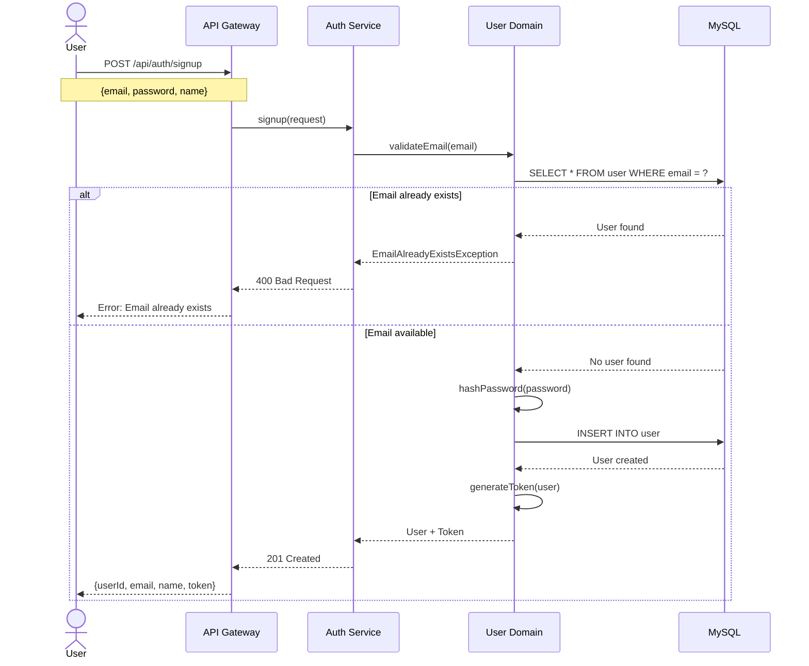
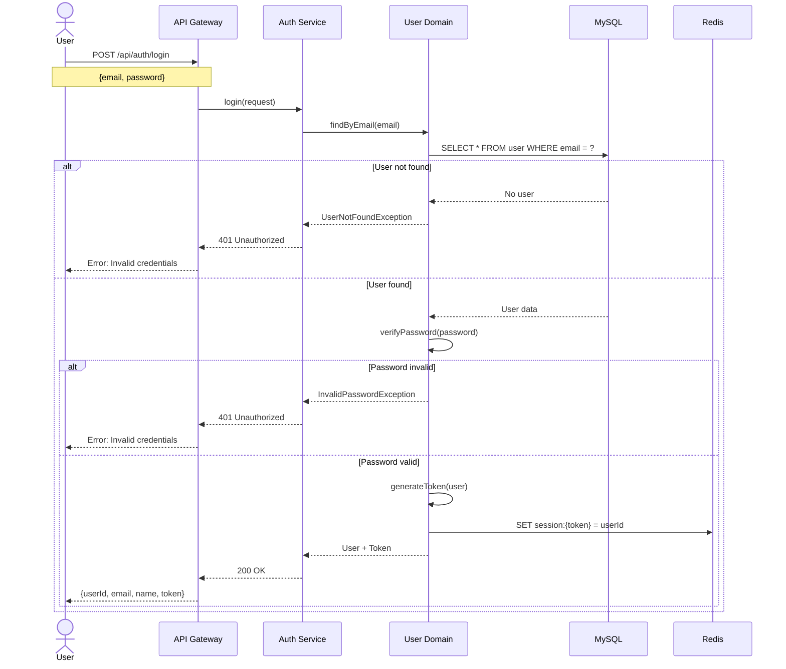
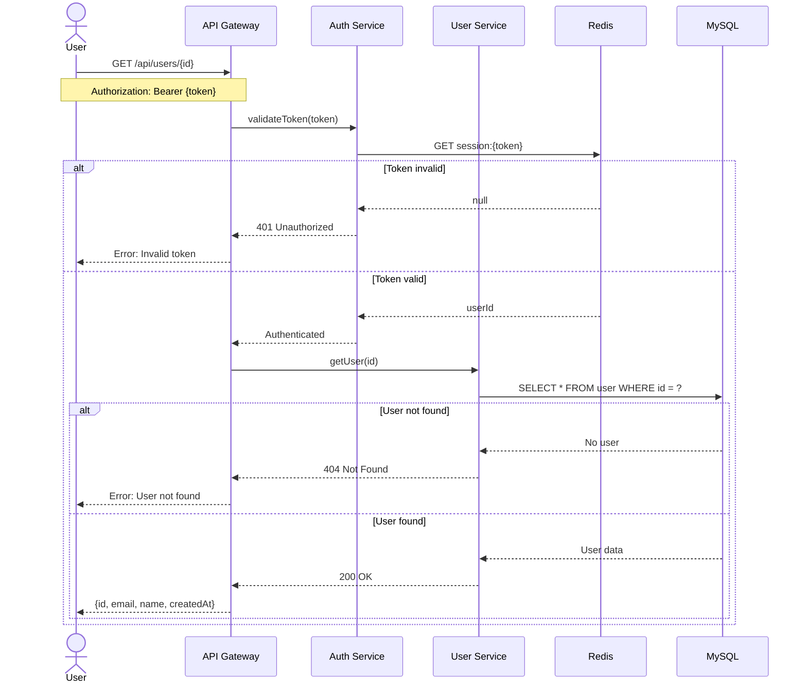

# Authentication Sequence Diagrams

## 1. 회원가입 (Signup)

```mermaid
sequenceDiagram
    actor User
    participant API as API Gateway
    participant Auth as Auth Service
    participant UserDomain as User Domain
    participant DB as MySQL
    
    User->>API: POST /api/auth/signup
    Note over User,API: {email, password, name}
    
    API->>Auth: signup(request)
    Auth->>UserDomain: validateEmail(email)
    UserDomain->>DB: SELECT * FROM user WHERE email = ?
    
    alt Email already exists
        DB-->>UserDomain: User found
        UserDomain-->>Auth: EmailAlreadyExistsException
        Auth-->>API: 400 Bad Request
        API-->>User: Error: Email already exists
    else Email available
        DB-->>UserDomain: No user found
        UserDomain->>UserDomain: hashPassword(password)
        UserDomain->>DB: INSERT INTO user
        DB-->>UserDomain: User created
        UserDomain->>UserDomain: generateToken(user)
        UserDomain-->>Auth: User + Token
        Auth-->>API: 201 Created
        API-->>User: {userId, email, name, token}
    end
```

---

## 2. 로그인 (Login)

```mermaid
sequenceDiagram
    actor User
    participant API as API Gateway
    participant Auth as Auth Service
    participant UserDomain as User Domain
    participant DB as MySQL
    participant Cache as Redis
    
    User->>API: POST /api/auth/login
    Note over User,API: {email, password}
    
    API->>Auth: login(request)
    Auth->>UserDomain: findByEmail(email)
    UserDomain->>DB: SELECT * FROM user WHERE email = ?
    
    alt User not found
        DB-->>UserDomain: No user
        UserDomain-->>Auth: UserNotFoundException
        Auth-->>API: 401 Unauthorized
        API-->>User: Error: Invalid credentials
    else User found
        DB-->>UserDomain: User data
        UserDomain->>UserDomain: verifyPassword(password)
        
        alt Password invalid
            UserDomain-->>Auth: InvalidPasswordException
            Auth-->>API: 401 Unauthorized
            API-->>User: Error: Invalid credentials
        else Password valid
            UserDomain->>UserDomain: generateToken(user)
            UserDomain->>Cache: SET session:{token} = userId
            UserDomain-->>Auth: User + Token
            Auth-->>API: 200 OK
            API-->>User: {userId, email, name, token}
        end
    end
```

---

## 3. 사용자 조회 (Get User)

```mermaid
sequenceDiagram
    actor User
    participant API as API Gateway
    participant Auth as Auth Service
    participant UserService as User Service
    participant Cache as Redis
    participant DB as MySQL
    
    User->>API: GET /api/users/{id}
    Note over User,API: Authorization: Bearer {token}
    
    API->>Auth: validateToken(token)
    Auth->>Cache: GET session:{token}
    
    alt Token invalid
        Cache-->>Auth: null
        Auth-->>API: 401 Unauthorized
        API-->>User: Error: Invalid token
    else Token valid
        Cache-->>Auth: userId
        Auth-->>API: Authenticated
        
        API->>UserService: getUser(id)
        UserService->>DB: SELECT * FROM user WHERE id = ?
        
        alt User not found
            DB-->>UserService: No user
            UserService-->>API: 404 Not Found
            API-->>User: Error: User not found
        else User found
            DB-->>UserService: User data
            UserService-->>API: 200 OK
            API-->>User: {id, email, name, createdAt}
        end
    end
```
