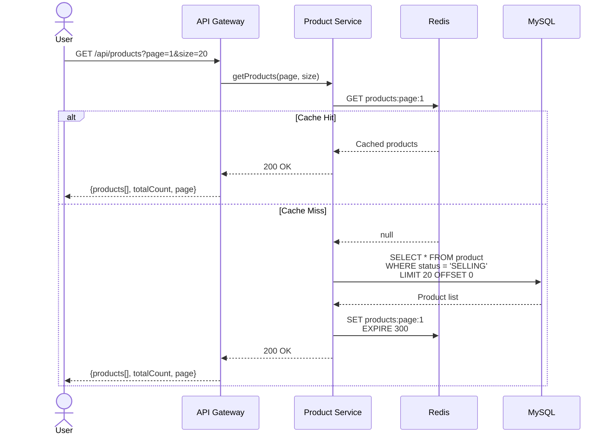
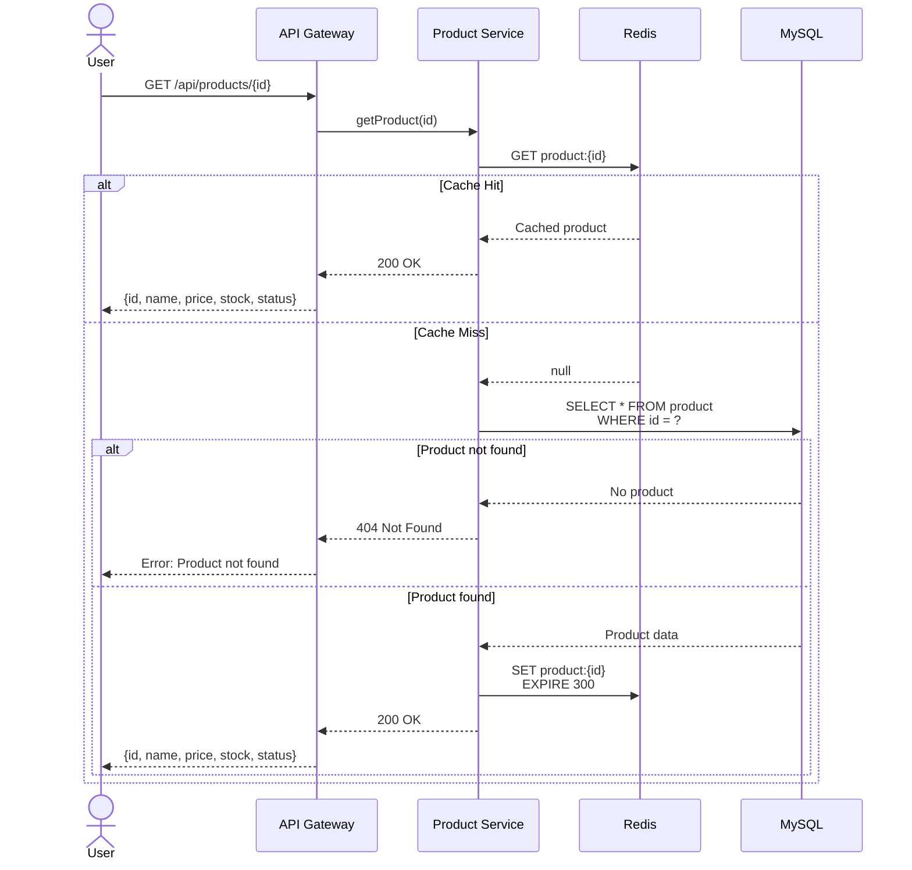
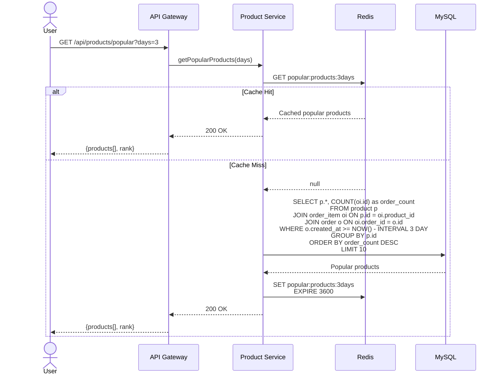

# Product Sequence Diagrams

## 1. 상품 목록 조회 (Get Products)

```mermaid
sequenceDiagram
    actor User
    participant API as API Gateway
    participant ProductService as Product Service
    participant Cache as Redis
    participant DB as MySQL
    
    User->>API: GET /api/products?page=1&size=20
    
    API->>ProductService: getProducts(page, size)
    ProductService->>Cache: GET products:page:1
    
    alt Cache Hit
        Cache-->>ProductService: Cached products
        ProductService-->>API: 200 OK
        API-->>User: {products[], totalCount, page}
    else Cache Miss
        Cache-->>ProductService: null
        ProductService->>DB: SELECT * FROM product<br/>WHERE status = 'SELLING'<br/>LIMIT 20 OFFSET 0
        DB-->>ProductService: Product list
        ProductService->>Cache: SET products:page:1<br/>EXPIRE 300
        ProductService-->>API: 200 OK
        API-->>User: {products[], totalCount, page}
    end
```

---

## 2. 상품 상세 조회 (Get Product Detail)

```mermaid
sequenceDiagram
    actor User
    participant API as API Gateway
    participant ProductService as Product Service
    participant Cache as Redis
    participant DB as MySQL
    
    User->>API: GET /api/products/{id}
    
    API->>ProductService: getProduct(id)
    ProductService->>Cache: GET product:{id}
    
    alt Cache Hit
        Cache-->>ProductService: Cached product
        ProductService-->>API: 200 OK
        API-->>User: {id, name, price, stock, status}
    else Cache Miss
        Cache-->>ProductService: null
        ProductService->>DB: SELECT * FROM product<br/>WHERE id = ?
        
        alt Product not found
            DB-->>ProductService: No product
            ProductService-->>API: 404 Not Found
            API-->>User: Error: Product not found
        else Product found
            DB-->>ProductService: Product data
            ProductService->>Cache: SET product:{id}<br/>EXPIRE 300
            ProductService-->>API: 200 OK
            API-->>User: {id, name, price, stock, status}
        end
    end
```

---

## 3. 인기 상품 조회 (Get Popular Products)

```mermaid
sequenceDiagram
    actor User
    participant API as API Gateway
    participant ProductService as Product Service
    participant Cache as Redis
    participant DB as MySQL
    
    User->>API: GET /api/products/popular?days=3
    
    API->>ProductService: getPopularProducts(days)
    ProductService->>Cache: GET popular:products:3days
    
    alt Cache Hit
        Cache-->>ProductService: Cached popular products
        ProductService-->>API: 200 OK
        API-->>User: {products[], rank}
    else Cache Miss
        Cache-->>ProductService: null
        ProductService->>DB: SELECT p.*, COUNT(oi.id) as order_count<br/>FROM product p<br/>JOIN order_item oi ON p.id = oi.product_id<br/>JOIN order o ON oi.order_id = o.id<br/>WHERE o.created_at >= NOW() - INTERVAL 3 DAY<br/>GROUP BY p.id<br/>ORDER BY order_count DESC<br/>LIMIT 10
        DB-->>ProductService: Popular products
        ProductService->>Cache: SET popular:products:3days<br/>EXPIRE 3600
        ProductService-->>API: 200 OK
        API-->>User: {products[], rank}
    end
```
