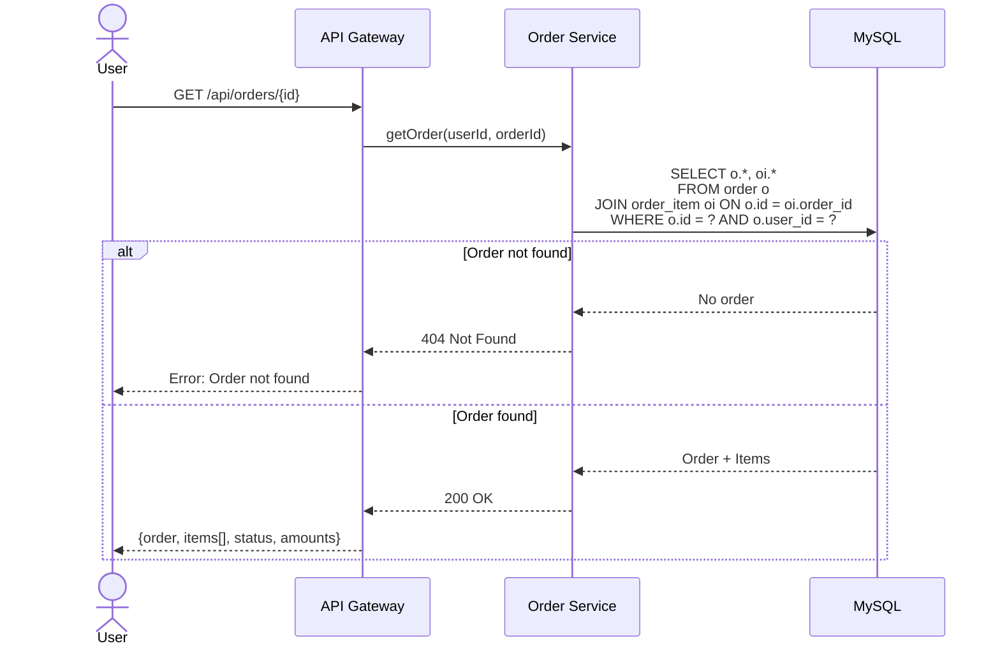
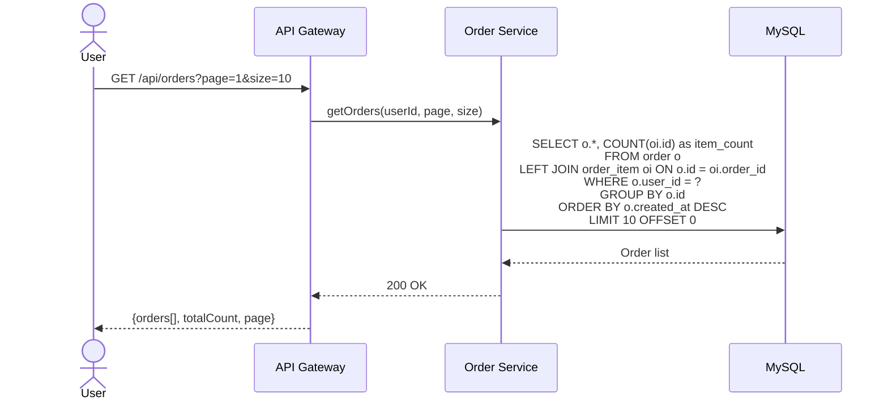

# Order Sequence Diagrams

## 1. 주문 생성 (Create Order)

```mermaid
sequenceDiagram
    actor User
    participant API as API Gateway
    participant OrderService as Order Service
    participant ProductService as Product Service
    participant CouponService as Coupon Service
    participant DB as MySQL
    participant Cache as Redis
    
    User->>API: POST /api/orders
    Note over User,API: {items: [{productId, quantity, couponId}],<br/>orderCouponIds: [uuid1, uuid2]}
    
    API->>OrderService: createOrder(userId, request)
    
    Note over OrderService: Transaction Start
    
    OrderService->>OrderService: sortItemsByProductId()
    Note over OrderService: 상품 ID 오름차순 정렬<br/>→ 데드락 방지
    
    loop For each item (sorted)
        OrderService->>ProductService: reserveStock(productId, quantity)
        ProductService->>DB: SELECT * FROM product<br/>WHERE id = ? FOR UPDATE
        
        alt Stock insufficient
            DB-->>ProductService: stock < quantity
            ProductService-->>OrderService: InsufficientStockException
            Note over OrderService: Transaction Rollback
            OrderService-->>API: 400 Bad Request
            API-->>User: Error: Insufficient stock
        else Stock available
            DB-->>ProductService: Product data
            ProductService->>DB: UPDATE product<br/>SET stock = stock - ?<br/>WHERE id = ? AND stock >= ?
            
            alt Update failed (affected_rows = 0)
                DB-->>ProductService: 0 rows updated
                ProductService-->>OrderService: InsufficientStockException
                Note over OrderService: Transaction Rollback
                OrderService-->>API: 400 Bad Request
                API-->>User: Error: Insufficient stock
            else Update success
                DB-->>ProductService: 1 row updated
                ProductService->>Cache: DEL product:{id}
                ProductService-->>OrderService: Reserved
            end
        end
    end
    
    opt Order coupons provided
        loop For each orderCouponId
            OrderService->>CouponService: validateAndReserve(userId, couponId)
            CouponService->>DB: SELECT uc.*, c.*<br/>FROM user_coupon uc<br/>JOIN coupon c ON uc.coupon_id = c.id<br/>WHERE uc.id = ? AND uc.user_id = ?<br/>FOR UPDATE
            
            alt Coupon invalid
                DB-->>CouponService: Invalid or used
                CouponService-->>OrderService: InvalidCouponException
                Note over OrderService: Transaction Rollback
                OrderService-->>API: 400 Bad Request
                API-->>User: Error: 쿠폰 적용 실패<br/>{couponName}: {reason}<br/>주문이 취소되었습니다.<br/>해당 쿠폰을 제외하고 다시 시도해주세요.
            else Coupon valid
                DB-->>CouponService: Coupon data
                CouponService->>CouponService: validateCouponType(apply_type='ORDER')
                CouponService->>DB: UPDATE user_coupon<br/>SET status = 'RESERVED'<br/>WHERE id = ?
                CouponService-->>OrderService: Coupon reserved
            end
        end
    end
    
    opt Item coupons provided
        loop For each item with couponId
            OrderService->>CouponService: validateAndReserve(userId, item.couponId)
            CouponService->>DB: SELECT uc.*, c.*<br/>FROM user_coupon uc<br/>JOIN coupon c ON uc.coupon_id = c.id<br/>WHERE uc.id = ? AND uc.user_id = ?<br/>FOR UPDATE
            
            alt Coupon invalid or wrong type
                DB-->>CouponService: Invalid
                CouponService-->>OrderService: InvalidCouponException
                Note over OrderService: Transaction Rollback
                OrderService-->>API: 400 Bad Request
                API-->>User: Error: 상품 쿠폰 적용 실패<br/>{couponName}: {reason}<br/>주문이 취소되었습니다.
            else Coupon valid
                DB-->>CouponService: Coupon data
                CouponService->>CouponService: validateCouponType(apply_type='PRODUCT')
                CouponService->>CouponService: validateProduct(productId)
                CouponService->>DB: UPDATE user_coupon<br/>SET status = 'RESERVED'<br/>WHERE id = ?
                CouponService-->>OrderService: Coupon reserved
            end
        end
    end
    
    OrderService->>OrderService: calculateAmounts()
    Note over OrderService: total_amount = Σ(item.price × quantity)<br/>discount_amount = Σ(쿠폰 할인액)<br/>final_amount = total - discount<br/>paid_amount = 0<br/>point_amount = 0<br/>remaining_amount = final_amount
    
    OrderService->>DB: INSERT INTO order<br/>(user_id, total_amount, discount_amount,<br/>final_amount, remaining_amount, status='PENDING')
    OrderService->>DB: INSERT INTO order_item (multiple)
    OrderService->>DB: INSERT INTO order_coupon (multiple)
    OrderService->>DB: INSERT INTO order_item_coupon (multiple)
    
    Note over OrderService: Transaction Commit
    
    OrderService-->>API: 201 Created
    API-->>User: {orderId, totalAmount, discountAmount,<br/>finalAmount, appliedCoupons[], status}
```

---

## 2. 주문 조회 (Get Order)

```mermaid
sequenceDiagram
    actor User
    participant API as API Gateway
    participant OrderService as Order Service
    participant DB as MySQL
    
    User->>API: GET /api/orders/{id}
    
    API->>OrderService: getOrder(userId, orderId)
    OrderService->>DB: SELECT o.*, oi.*<br/>FROM order o<br/>JOIN order_item oi ON o.id = oi.order_id<br/>WHERE o.id = ? AND o.user_id = ?
    
    alt Order not found
        DB-->>OrderService: No order
        OrderService-->>API: 404 Not Found
        API-->>User: Error: Order not found
    else Order found
        DB-->>OrderService: Order + Items
        OrderService-->>API: 200 OK
        API-->>User: {order, items[], status, amounts}
    end
```

---

## 3. 주문 목록 조회 (Get Orders)

```mermaid
sequenceDiagram
    actor User
    participant API as API Gateway
    participant OrderService as Order Service
    participant DB as MySQL
    
    User->>API: GET /api/orders?page=1&size=10
    
    API->>OrderService: getOrders(userId, page, size)
    OrderService->>DB: SELECT o.*, COUNT(oi.id) as item_count<br/>FROM order o<br/>LEFT JOIN order_item oi ON o.id = oi.order_id<br/>WHERE o.user_id = ?<br/>GROUP BY o.id<br/>ORDER BY o.created_at DESC<br/>LIMIT 10 OFFSET 0
    
    DB-->>OrderService: Order list
    OrderService-->>API: 200 OK
    API-->>User: {orders[], totalCount, page}
```
