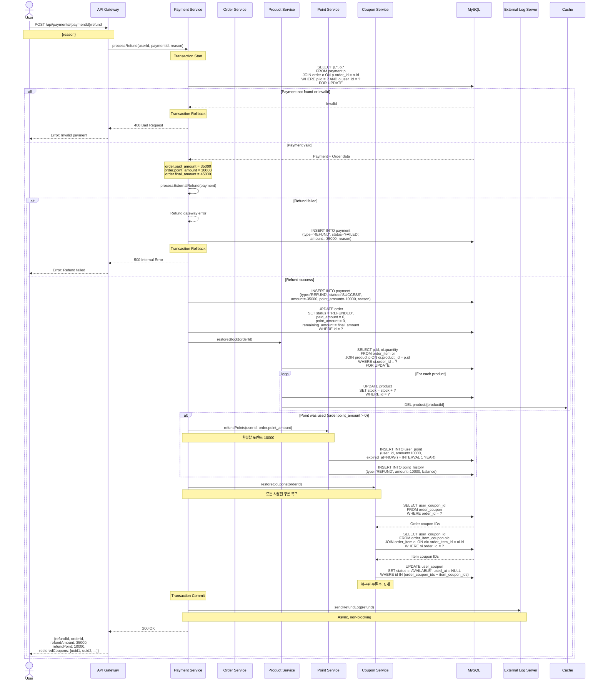
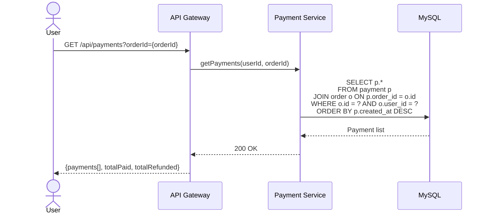

# Payment Sequence Diagrams

## 1. 결제 처리 (Process Payment)

```mermaid
sequenceDiagram
    actor User
    participant API as API Gateway
    participant PaymentService as Payment Service
    participant OrderService as Order Service
    participant PointService as Point Service
    participant CouponService as Coupon Service
    participant DB as MySQL
    participant LogServer as External Log Server
    
    User->>API: POST /api/payments
    Note over User,API: {orderId, pointAmount}
    
    API->>PaymentService: processPayment(userId, request)
    
    Note over PaymentService: ===== 사전 검증 단계 =====
    
    PaymentService->>OrderService: getOrder(orderId, userId)
    OrderService->>DB: SELECT * FROM order<br/>WHERE id = ? AND user_id = ?
    
    alt Order not found
        DB-->>OrderService: No order
        OrderService-->>PaymentService: OrderNotFoundException
        PaymentService-->>API: 404 Not Found
        API-->>User: Error: Order not found
    else Order found
        DB-->>OrderService: Order data
        Note over OrderService: final_amount = 45000<br/>discount_amount = 5000
        OrderService-->>PaymentService: Order
        
        PaymentService->>PaymentService: calculatePayment()
        Note over PaymentService: payAmount = final_amount - pointAmount<br/>= 45000 - 10000 = 35000
        
        alt pointAmount > final_amount
            PaymentService-->>API: 400 Bad Request
            API-->>User: Error: Point exceeds order amount
        else Valid amount
            opt pointAmount > 0
                PaymentService->>PointService: checkBalance(userId, pointAmount)
                PointService->>DB: SELECT SUM(amount) as balance<br/>FROM user_point<br/>WHERE user_id = ?<br/>AND expired_at > NOW()
                
                alt Insufficient points
                    DB-->>PointService: balance < pointAmount
                    PointService-->>PaymentService: InsufficientPointsException
                    PaymentService-->>API: 400 Bad Request
                    API-->>User: Error: Insufficient points<br/>(Required: 10000, Available: 5000)
                else Points available
                    DB-->>PointService: balance >= pointAmount
                    PointService-->>PaymentService: Balance OK
                end
            end
            
            Note over PaymentService: ===== 트랜잭션 시작 =====
            Note over PaymentService: Transaction Start
            
            PaymentService->>OrderService: validateOrderForUpdate(orderId)
            OrderService->>DB: SELECT * FROM order<br/>WHERE id = ? AND user_id = ?<br/>FOR UPDATE
            
            alt Order status invalid
                DB-->>OrderService: status != PENDING
                OrderService-->>PaymentService: InvalidOrderStatusException
                Note over PaymentService: Transaction Rollback
                PaymentService-->>API: 400 Bad Request
                API-->>User: Error: Order already processed
            else Order valid
                DB-->>OrderService: Order locked
                OrderService-->>PaymentService: Order validated
                
                opt pointAmount > 0
                    PaymentService->>PointService: usePoints(userId, pointAmount)
                    PointService->>DB: SELECT SUM(amount) as balance<br/>FROM user_point<br/>WHERE user_id = ?<br/>AND expired_at > NOW()<br/>FOR UPDATE
                    
                    alt Insufficient points (재확인)
                        DB-->>PointService: balance < pointAmount
                        Note over PointService: 다른 트랜잭션이 먼저 사용
                        PointService-->>PaymentService: InsufficientPointsException
                        Note over PaymentService: Transaction Rollback
                        PaymentService-->>API: 409 Conflict
                        API-->>User: Error: Points used by another request
                    else Points deducted
                        DB-->>PointService: Balance OK
                        
                        Note over PointService: 만료일 순으로 차감 (FIFO)
                        loop Until remaining = 0
                            PointService->>DB: SELECT id, amount<br/>FROM user_point<br/>WHERE user_id = ? AND amount > 0<br/>AND expired_at > NOW()<br/>ORDER BY expired_at ASC LIMIT 1<br/>FOR UPDATE
                            
                            alt point.amount >= remaining
                                PointService->>DB: UPDATE user_point<br/>SET amount = amount - remaining<br/>WHERE id = ?
                                Note over PointService: remaining = 0, 종료
                            else point.amount < remaining
                                PointService->>DB: UPDATE user_point<br/>SET amount = 0<br/>WHERE id = ?
                                Note over PointService: remaining -= point.amount, 계속
                            end
                        end
                        
                        PointService->>DB: INSERT INTO point_history<br/>(type='USE', amount=-10000, balance)
                        PointService-->>PaymentService: Points used
                    end
                end
                
                PaymentService->>PaymentService: processExternalPayment(payAmount)
                
                alt Payment failed
                    PaymentService-->>PaymentService: Payment gateway error
                    PaymentService->>DB: INSERT INTO payment<br/>(type='PAYMENT', status='FAILED',<br/>amount=35000, point_amount=10000)
                    Note over PaymentService: Transaction Rollback
                    PaymentService-->>API: 500 Internal Error
                    API-->>User: Error: Payment failed
                else Payment success
                    PaymentService->>DB: INSERT INTO payment<br/>(type='PAYMENT', status='SUCCESS',<br/>amount=35000, point_amount=10000)
                    
                    PaymentService->>DB: UPDATE order<br/>SET status = 'PAID',<br/>paid_amount = 35000,<br/>point_amount = 10000,<br/>remaining_amount = 0<br/>WHERE id = ?
                    
                    opt Coupons used
                        PaymentService->>CouponService: confirmCoupons(orderId)
                        CouponService->>DB: UPDATE user_coupon uc<br/>SET status = 'USED', used_at = NOW()<br/>WHERE id IN (<br/>  SELECT user_coupon_id FROM order_coupon WHERE order_id = ?<br/>  UNION<br/>  SELECT user_coupon_id FROM order_item_coupon oic<br/>  JOIN order_item oi ON oic.order_item_id = oi.id<br/>  WHERE oi.order_id = ?<br/>)
                        Note over CouponService: 쿠폰이 없으면 0개 업데이트
                    end
                    
                    Note over PaymentService: Transaction Commit
                    
                    PaymentService->>LogServer: sendPaymentLog(payment)
                    Note over PaymentService,LogServer: Async, non-blocking
                    
                    PaymentService-->>API: 200 OK
                    API-->>User: {paymentId, orderId,<br/>paidAmount: 35000,<br/>pointAmount: 10000,<br/>totalAmount: 45000}
                end
            end
        end
    end
```

---

## 2. 환불 처리 (Process Refund)

```mermaid
sequenceDiagram
    actor User
    participant API as API Gateway
    participant PaymentService as Payment Service
    participant OrderService as Order Service
    participant ProductService as Product Service
    participant PointService as Point Service
    participant CouponService as Coupon Service
    participant DB as MySQL
    participant LogServer as External Log Server
    
    User->>API: POST /api/payments/{paymentId}/refund
    Note over User,API: {reason}
    
    API->>PaymentService: processRefund(userId, paymentId, reason)
    
    Note over PaymentService: Transaction Start
    
    PaymentService->>DB: SELECT p.*, o.*<br/>FROM payment p<br/>JOIN order o ON p.order_id = o.id<br/>WHERE p.id = ? AND o.user_id = ?<br/>FOR UPDATE
    
    alt Payment not found or invalid
        DB-->>PaymentService: Invalid
        Note over PaymentService: Transaction Rollback
        PaymentService-->>API: 400 Bad Request
        API-->>User: Error: Invalid payment
    else Payment valid
        DB-->>PaymentService: Payment + Order data
        Note over PaymentService: order.paid_amount = 35000<br/>order.point_amount = 10000<br/>order.final_amount = 45000
        
        PaymentService->>PaymentService: processExternalRefund(payment)
        
        alt Refund failed
            PaymentService-->>PaymentService: Refund gateway error
            PaymentService->>DB: INSERT INTO payment<br/>(type='REFUND', status='FAILED',<br/>amount=-35000, reason)
            Note over PaymentService: Transaction Rollback
            PaymentService-->>API: 500 Internal Error
            API-->>User: Error: Refund failed
        else Refund success
            PaymentService->>DB: INSERT INTO payment<br/>(type='REFUND', status='SUCCESS',<br/>amount=-35000, point_amount=-10000, reason)
            
            PaymentService->>DB: UPDATE order<br/>SET status = 'REFUNDED',<br/>paid_amount = 0,<br/>point_amount = 0,<br/>remaining_amount = final_amount<br/>WHERE id = ?
            
            PaymentService->>ProductService: restoreStock(orderId)
            
            ProductService->>DB: SELECT p.id, oi.quantity<br/>FROM order_item oi<br/>JOIN product p ON oi.product_id = p.id<br/>WHERE oi.order_id = ?<br/>FOR UPDATE
            
            loop For each product
                ProductService->>DB: UPDATE product<br/>SET stock = stock + ?<br/>WHERE id = ?
                
                ProductService->>Cache: DEL product:{productId}
            end
            
            alt Point was used (order.point_amount > 0)
                PaymentService->>PointService: refundPoints(userId, order.point_amount)
                Note over PaymentService,PointService: 환불할 포인트: 10000
                PointService->>DB: INSERT INTO user_point<br/>(user_id, amount=10000,<br/>expired_at=NOW() + INTERVAL 1 YEAR)
                PointService->>DB: INSERT INTO point_history<br/>(type='REFUND', amount=10000, balance)
            end
            
            PaymentService->>CouponService: restoreCoupons(orderId)
            Note over PaymentService,CouponService: 모든 사용된 쿠폰 복구
            
            CouponService->>DB: SELECT user_coupon_id<br/>FROM order_coupon<br/>WHERE order_id = ?
            DB-->>CouponService: Order coupon IDs
            
            CouponService->>DB: SELECT user_coupon_id<br/>FROM order_item_coupon oic<br/>JOIN order_item oi ON oic.order_item_id = oi.id<br/>WHERE oi.order_id = ?
            DB-->>CouponService: Item coupon IDs
            
            CouponService->>DB: UPDATE user_coupon<br/>SET status = 'AVAILABLE', used_at = NULL<br/>WHERE id IN (order_coupon_ids + item_coupon_ids)
            Note over CouponService: 복구된 쿠폰 수: N개
            
            Note over PaymentService: Transaction Commit
            
            PaymentService->>LogServer: sendRefundLog(refund)
            Note over PaymentService,LogServer: Async, non-blocking
            
            PaymentService-->>API: 200 OK
            API-->>User: {refundId, orderId,<br/>refundAmount: 35000,<br/>refundPoint: 10000,<br/>restoredCoupons: [uuid1, uuid2, ...]}
        end
    end
```

---

## 3. 결제 내역 조회 (Get Payment History)

```mermaid
sequenceDiagram
    actor User
    participant API as API Gateway
    participant PaymentService as Payment Service
    participant DB as MySQL
    
    User->>API: GET /api/payments?orderId={orderId}
    
    API->>PaymentService: getPayments(userId, orderId)
    PaymentService->>DB: SELECT p.*<br/>FROM payment p<br/>JOIN order o ON p.order_id = o.id<br/>WHERE o.id = ? AND o.user_id = ?<br/>ORDER BY p.created_at DESC
    
    DB-->>PaymentService: Payment list
    PaymentService-->>API: 200 OK
    API-->>User: {payments[], totalPaid, totalRefunded}
```
