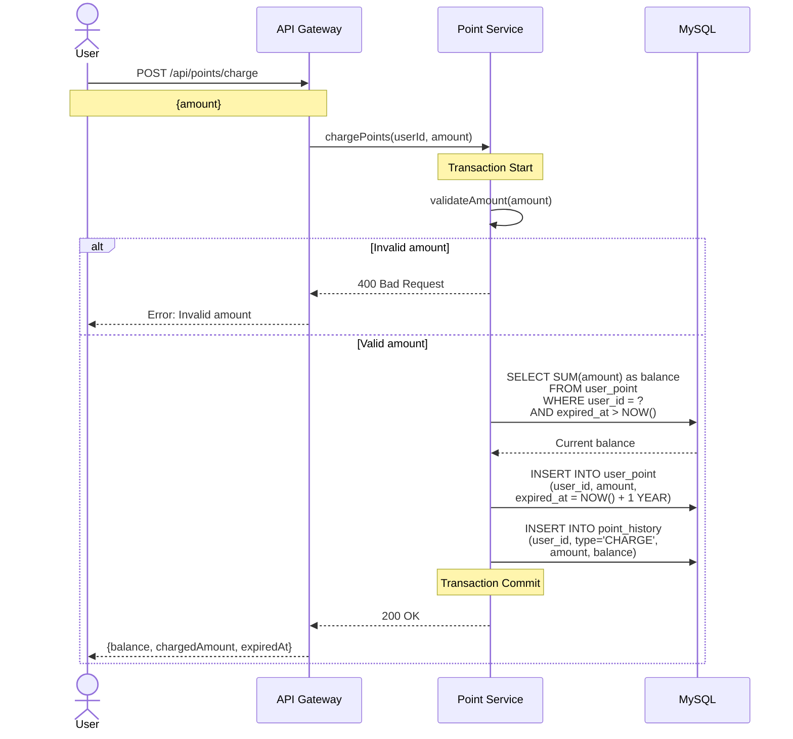
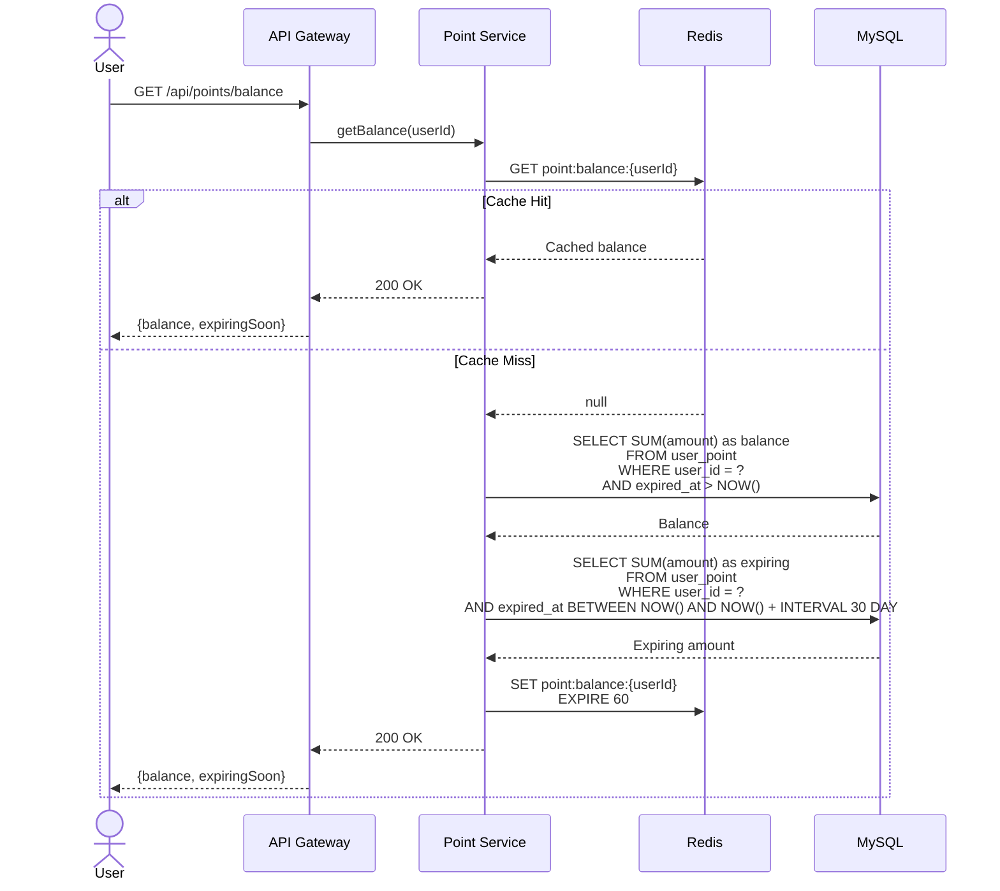
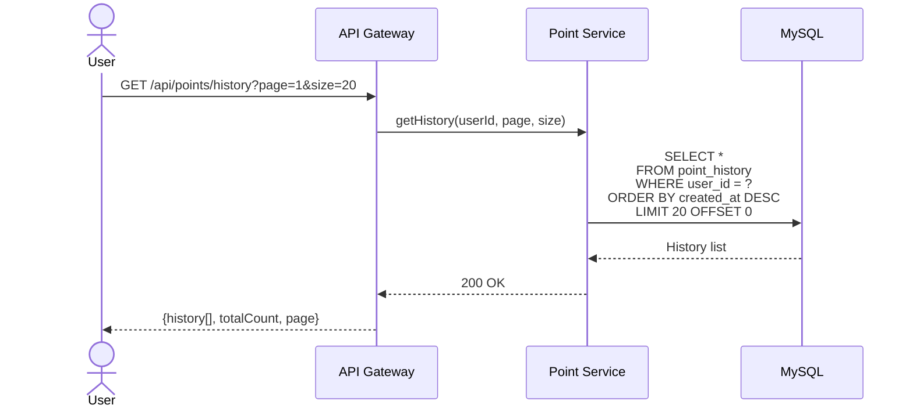
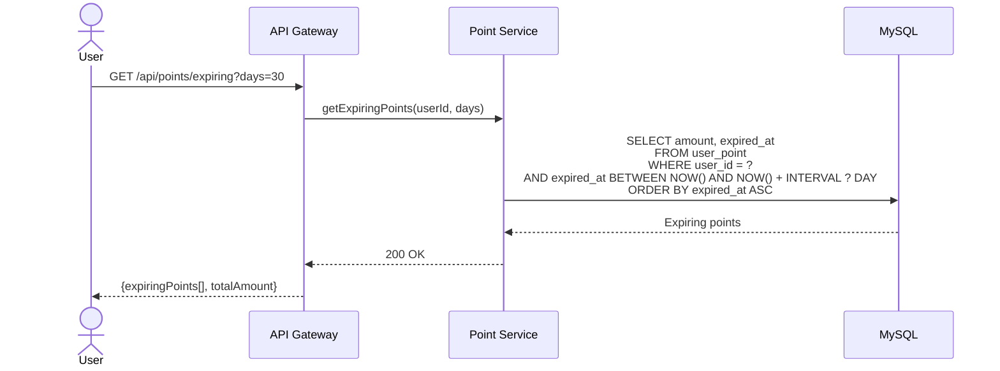

# Point Sequence Diagrams

## 1. 포인트 충전 (Charge Points)

```mermaid
sequenceDiagram
    actor User
    participant API as API Gateway
    participant PointService as Point Service
    participant DB as MySQL
    
    User->>API: POST /api/points/charge
    Note over User,API: {amount}
    
    API->>PointService: chargePoints(userId, amount)
    
    Note over PointService: Transaction Start
    
    PointService->>PointService: validateAmount(amount)
    
    alt Invalid amount
        PointService-->>API: 400 Bad Request
        API-->>User: Error: Invalid amount
    else Valid amount
        PointService->>DB: SELECT SUM(amount) as balance<br/>FROM user_point<br/>WHERE user_id = ?<br/>AND expired_at > NOW()
        DB-->>PointService: Current balance
        
        PointService->>DB: INSERT INTO user_point<br/>(user_id, amount,<br/>expired_at = NOW() + 1 YEAR)
        
        PointService->>DB: INSERT INTO point_history<br/>(user_id, type='CHARGE',<br/>amount, balance)
        
        Note over PointService: Transaction Commit
        
        PointService-->>API: 200 OK
        API-->>User: {balance, chargedAmount, expiredAt}
    end
```

---

## 2. 포인트 잔액 조회 (Get Point Balance)

```mermaid
sequenceDiagram
    actor User
    participant API as API Gateway
    participant PointService as Point Service
    participant Cache as Redis
    participant DB as MySQL
    
    User->>API: GET /api/points/balance
    
    API->>PointService: getBalance(userId)
    PointService->>Cache: GET point:balance:{userId}
    
    alt Cache Hit
        Cache-->>PointService: Cached balance
        PointService-->>API: 200 OK
        API-->>User: {balance, expiringSoon}
    else Cache Miss
        Cache-->>PointService: null
        PointService->>DB: SELECT SUM(amount) as balance<br/>FROM user_point<br/>WHERE user_id = ?<br/>AND expired_at > NOW()
        DB-->>PointService: Balance
        
        PointService->>DB: SELECT SUM(amount) as expiring<br/>FROM user_point<br/>WHERE user_id = ?<br/>AND expired_at BETWEEN NOW() AND NOW() + INTERVAL 30 DAY
        DB-->>PointService: Expiring amount
        
        PointService->>Cache: SET point:balance:{userId}<br/>EXPIRE 60
        PointService-->>API: 200 OK
        API-->>User: {balance, expiringSoon}
    end
```

---

## 3. 포인트 사용 내역 조회 (Get Point History)

```mermaid
sequenceDiagram
    actor User
    participant API as API Gateway
    participant PointService as Point Service
    participant DB as MySQL
    
    User->>API: GET /api/points/history?page=1&size=20
    
    API->>PointService: getHistory(userId, page, size)
    PointService->>DB: SELECT *<br/>FROM point_history<br/>WHERE user_id = ?<br/>ORDER BY created_at DESC<br/>LIMIT 20 OFFSET 0
    
    DB-->>PointService: History list
    PointService-->>API: 200 OK
    API-->>User: {history[], totalCount, page}
```

---

## 4. 만료 예정 포인트 조회 (Get Expiring Points)

```mermaid
sequenceDiagram
    actor User
    participant API as API Gateway
    participant PointService as Point Service
    participant DB as MySQL
    
    User->>API: GET /api/points/expiring?days=30
    
    API->>PointService: getExpiringPoints(userId, days)
    PointService->>DB: SELECT amount, expired_at<br/>FROM user_point<br/>WHERE user_id = ?<br/>AND expired_at BETWEEN NOW() AND NOW() + INTERVAL ? DAY<br/>ORDER BY expired_at ASC
    
    DB-->>PointService: Expiring points
    PointService-->>API: 200 OK
    API-->>User: {expiringPoints[], totalAmount}
```
