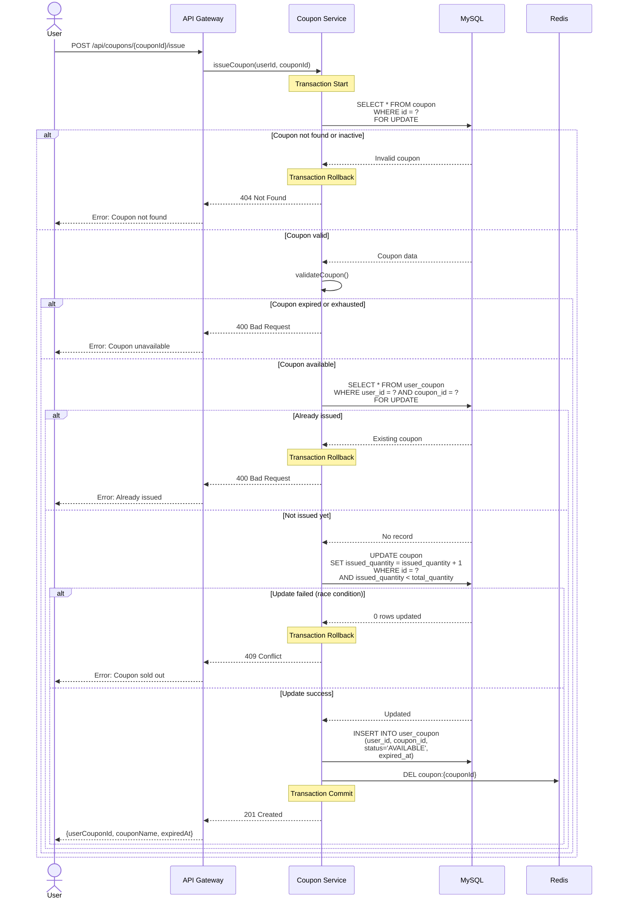
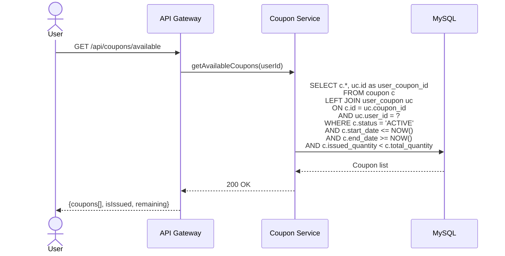
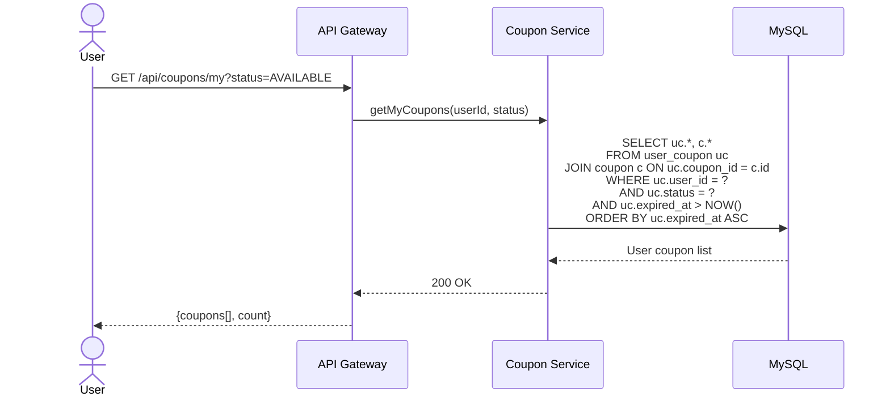
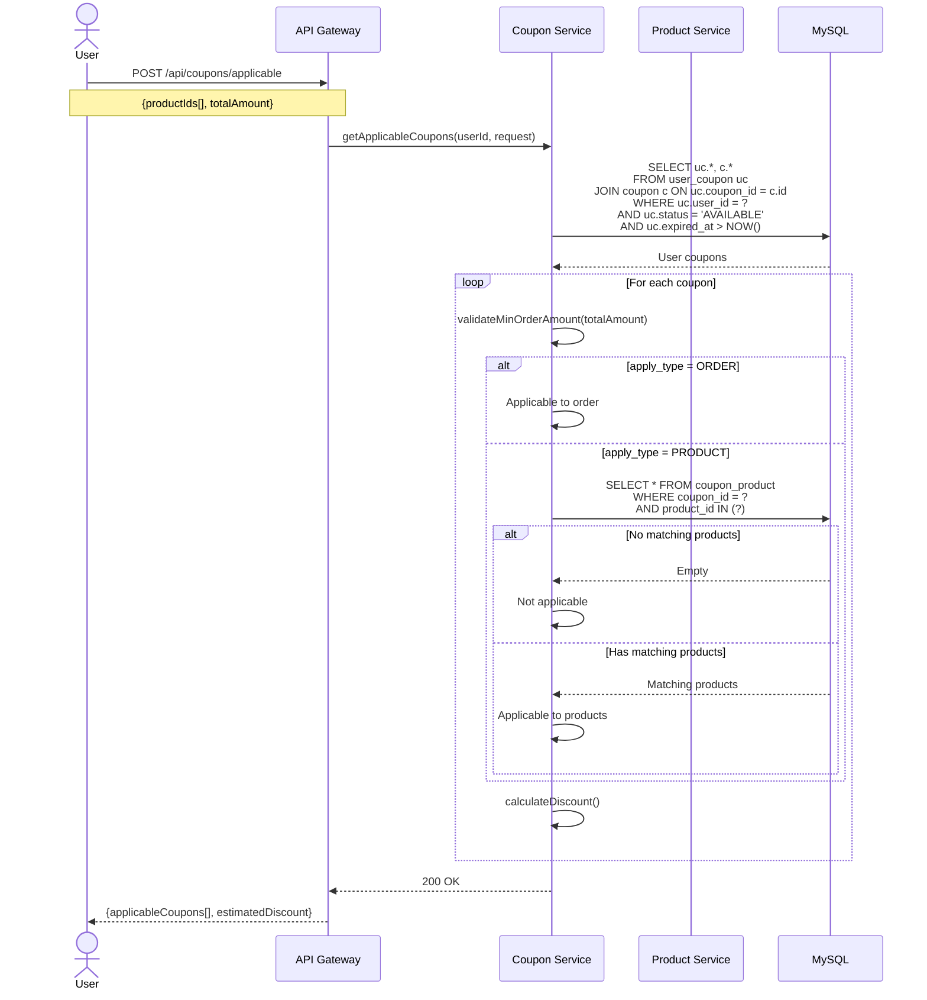
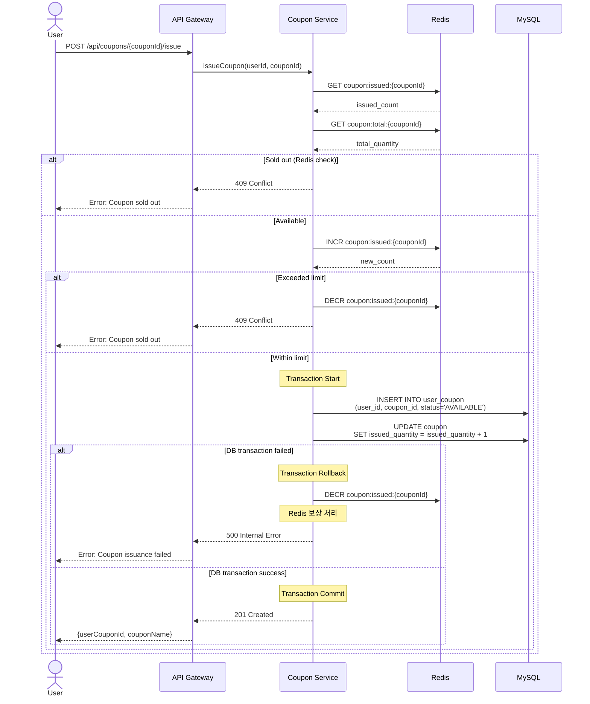

# Coupon Sequence Diagrams

## 1. 쿠폰 발급 (Issue Coupon)

---

## 2. 사용 가능한 쿠폰 조회 (Get Available Coupons)

---

## 3. 내 쿠폰 조회 (Get My Coupons)

---

## 4. 주문에 적용 가능한 쿠폰 조회 (Get Applicable Coupons for Order)

---

## 5. 선착순 쿠폰 발급 (Issue First-Come Coupon with Redis)

